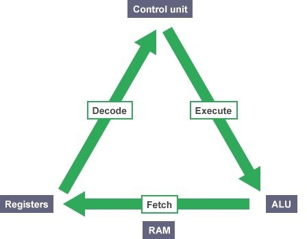

# 01-Introduction

## Terminology

The basic operations of a computer will form what is known as the computer's **instruction set**. To solve a problem using a computer, you must provide a solution to the problem by sending instructions to the instruction set.

A computer **program** sends the instructions necessary to solve a specific problem, the approach or method that is used to solve the problem is known as an **algorithm**. If we were to create a program that tests if a number is odd or even, the statements that solve the problem becomes the program, the method that is used to test if the number is even or odd is the algorithm. To write a program, you need to write the instructions necessary to implement the algorithm these instructions would be expressed in the statements of a particular computer language, such as Java, C++, Objective-C, or C.

### CPU

central processing unit: does most of the computing work; Instructions are executed here

### RAM

random access memory: Stores the data of a program while it is running

### hard drive

permanent storage: stores files that contain program source code, even while the computer is turned off

### Operating System

a program that controls the entire operation of a computer, developed to help make it more convenient to use computers; manages the computer's resources and handles the execution of programs (Windows, Unix, Android, etc.)

### fetch / Execute Cycle

(life of a CPU): fetches an instruction from memory (using registers) and executes it (loop). A gigahertz CPU can do this about a billion times a second.



[https://www.bbc.co.uk/bitesize/guides/z2342hv/revision/5]()

## Higher Level Programming Languages

High-level programming languages make it easier to write programs. They're the Opposite of assembly language. C is a higher level programming language that describes actions in a more abstract form. The instructions (statements) of a program look more like problem solving steps. You do not have to worry about the precise steps a particular CPU would have to take to accomplish a particular task.

### Compilers

A program that translates the high-level language source code into the detailed set of machine language instructions the computer requires. The program does the high-level thinking and the compiler generates the tedious instructions to the cpu. Compilers will also check that your program has valid syntax for the programming language that you are compiling. It finds errors and reports them to you and doesn't produce an executable until you fix them.

### Writing a program

the act of writing a C program can be broken down into multiple steps

1. Define the Program Obiectives
   Understand the requirements of the program
   Get a clear idea of what you want the program to accomplish
2. Design
   Decide how the program will meet the above requirements
   What should the user interface be like?
   How should the program be organized?
3. Write the Code
   Start implementation, translate the design in the syntax of C
   you need to use a text editor to create what is called a source code file
4. Compile
   translate the source code into machine code (executable code)
   consists of detailed instructions to the CPU expressed in a numeric code
5. Run the Program
   the executable file is a program you can run
6. Test and Debug
   Just because a program is running, does not mean it works as intended
   Need to test, to see that your program does what it is supposed to do (may find bugs)
   Debugging is the process of finding and fixing program errors
   Making mistakes is a natural part of learning
7. Maintain and Modify the Program
   Programs are released and used by many people
   have to continue to fix new bugs or add new features

For the above steps, you may have to jump around steps and repeat steps e.g. when you are writing code, you might find that your plan was impractical. Also, while you are coding, you always want to work in small steps and constantly test (divide and conquer)

## Overview of C Language

### Overview

C is a general-purpose, imperative computer programming language that supports structured programming. It uses statements that change a program's state, focuses on how.

C is a modern language, it has most basic control structures and features of modern languages
designed for **top-down** planning. it organized around the use of functions (modular design) structured programming. It's a very reliable and readable program.

C is used on everything from minicomputers, Unix/Linux systems to pc's and mainframes; C is the preferred language for producing word processing programs, spreadsheets and compilers; C has become popular for programming embedded systems, used to program microprocessors found in automobiles, cameras, DVD players, etc; C has and continues to play a strong role in the development of Linux.

C programs are easy to modify and easy to adapt to new models or languages. In the 1990s, many software houses began turning to the C++ language for large programming projects. **C is a subset of C++** with object-oriented programming tools added, and any C program is a valid C++ program. By learning C, you also learn much of C++. C provides constructs that map efficiently to typical machine instructions and thus is used by programs that were previously implement in assembly language. It **provides low-level access to memory** (has many low-level capabilities)
requires minimal run-time support.

### History

C was invented in 1972 by Dennis Ritchie of Bell Laboratories.Ritchie was working on the design of the UNIX operating System and C was created as a tool for working programmers. The main goal is to be a useful language with easy readability and writability. C initially became widely known as the development language of the UNIX operating system. Virtually all new major operating systems are written in C and/or C++.

C evolved from a previous programming language named B.  It uses many of the important concepts of B while adding data typing and other powerful features. B was a "typeless" language - every data item occupied one "word" in memory, and the burden of typing variables fell on the shoulders of the programmer.

C is available for most computers. C is also hardware independent.

### Standard

By the late 1970s, C had evolved into what is now referred to as "**traditional C**". The rapid expansion of C working on many different hardware platforms led to many variations that were similar but often incompatible.A standard version of C was created (**C89/C90, C99, C11**).

A program written only in Standard C and without any hardware-dependent, assumptions will run correctly on any platform with a standard C compiler. Non-standard C programs may run only on a certain platform or with a particular compiler.

#### C89

is supported by current C compilers; most C code being written today is based on it

#### C99

is a revised standard for the C programming language that refines and expands the capabilities of C; has not been widely adopted and not all popular C compilers support it

#### C11

the current standard is commonly referred to as C11; some elements of the language as defined by C11 are optional; also possible that a C11 compiler may not implement all of the language features mandated by the C11 standard

## Language Features

The main features of C are the following

#### Efficient

takes advantage of the capabilities of current computers; C programs are compact and fast (similar to assembly language programs); programmers can fine-tune their programs for maximum speed or most efficient use of memory

#### Portable

C programs written on one system can be run on other systems with little or no modification. Compilers are available for many computer architectures. Linux/Unix systems typically come with a C compiler as part of the package. Compilers are available for personal computers. A good chance that you can get a C compiler for whatever device you are using.

### Powerful and Flexible

The Unix/Linux kernel is written in C. Many compilers and interpreters for other languages (FORTRAN, Perl, Python, Pascal, LISP, Logo, and BASIC) have been written in C. C programs have been used for solving physics and engineering problems and even for animating special effects for movies.

C used for developing just about everything you can imagine by way of a computer program; accounting applications to word processing and from games to operating systems

It is the basis for more advanced languages, such as C++. It is also used for developing mobile phone apps in the form of Objective C.

### Programmer Oriented

C fulfills the needs of programmers: gives you access to hardware; enables you to manipulate individual bits in memory. C contains a large selection of operators which allows you to express yourself succinctly. C is less strict than most languages in limiting what you can do----can be both an advantage and a danger: advantage is that many tasks (such as converting forms of data) are easier in C; danger is that you can make mistakes (pointers) that are impossible in some languages. C gives you more freedom, but it also puts more responsibility on you.

C implementations have a large library of useful C functions, they deal with common needs of most programmers.

### Other Features

provides low level features that are generally provided by the Lower level languages

programs can be manipulated using bits: ability to manage memory representation at bit level, provides wide variety of bit manipulation operators

pointers play a big role in C: direct access to memory; supports efficient use of pointers

Disadvantages
Flexibility and freedom also requires added responsibility. Use of pointers is problematic and abused. You can make programming errors that are difficult to trace. Sometimes because of its wealth of operators and its conciseness, it makes the language difficult to read and follow, there is an opportunity to write obscure code.

## Creating a C Program

The processes of editing, compiling, linking, and executing are essentially the same for developing programs in any environment and with any compiled language.

### Editing

Editing is the process of creating and modifying your C source code. **Source code** is inside a file and contains the program instructions you write. Remember to choose a wise name for your base file name (all source files end in the **.c** extension).

### Compiling

A compiler converts your source code into machine language and detects and reports errors in your code. The input to the compiler is the file you produce during your editing (source file).

Compilation is a two-stage process
The first stage is called the preprocessing phase, during which your code may be modified or added to. The second stage is the actual compilation that generates the object code.

The compiler examines each program statement and checks it to ensure that it conforms to the syntax and semantics of the language. It can also recognize structural errors (dead code). But it does not find logic errors. Typical errors reported might be due to an expression that has unbalanced parentheses (**syntactic error**), or due to the use of a variable that is not "defined" (**semantic error**).

After all errors are fixed, the compiler will then take each statement of the program and translate it into assembly language. The compiler will then translate the assembly language statements into actual machine instructions. The output from the compiler is known as **object code** and it is stored in files called object files (same name as source file with a **.obj** or **.o** extension).

The standard command to compile your C programs will be cc (or the GNU compiler, which is .gcc).

```
gcc-c myprog.c//or
cc -c myprog.c //If you omit the -c flag, your program will automatically be linked as well
```

### Linking

After the program has been translated into object code, it is ready to be linked. The purpose of the linking phase is to get the program into a final form for execution on the computer. Linking usually occurs automatically when compiling depending on what system you are on, but, can sometimes be a separate command.

The linker combines the object modules generated by the compiler with additional libraries needed by the program to create the whole executable. It also detects and reports errors, if part of your program is missing or a nonexistent library component is referenced.

Program **libraries** support and extend the C language by providing routines to carry out operations that are not part of the language: input and output libraries, mathematical libraries, string manipulation libraries.

A failure during the linking phase means that once again you have to go back and edit your source code. Success will produce an executable file. In a Windows environment, the executable file will have an **.exe** extension; in UNIX / Linux, there will be no such extension (**a.out** by default). Many IDEs have a build option, which will compile and link your program in a single operation to produce the executable.

A program of any significant size will consist of several source code files. Each source code file needs the compiler to generate the object file that need to be linked. The program is much easier to manage by breaking it up into a number of smaller source files. It is cohesive and makes the development and maintenance of the program a lot easier. The set of source files that make up the program will usually be integrated under a project name, which is used to refer to the whole program.

### Executing

In most IDEs, you'll find an appropriate menu command that allows you to run or execute your compiled program. Otherwise double click the **.exe** file or type **a.out** on the console in linux manually.

The execution stage is where you run your program. Each of the statements of the program is sequentially executed in turn. If the program requests any data from the user the program temporarily suspends its execution so that the input can be entered. Results that are displayed by the program (output) appear in a window called the console. This stage can also generate a wide variety of error conditions. It may produce the wrong output; it may just sit there and do nothing; lastly it may crash your computer.

If the program does not perform the intended functionality then it will be necessary to go back and reanalyze the program's logic. This is known as the debugging phase, correct all the known problems or bugs from the program. You will need to make changes to the original source program.

### C Stages

The entire process of compiling, linking, and executing the program must be repeated until the desired results are obtained.


