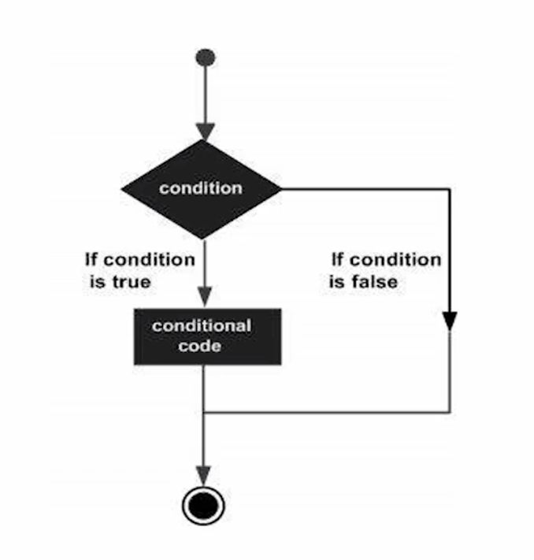
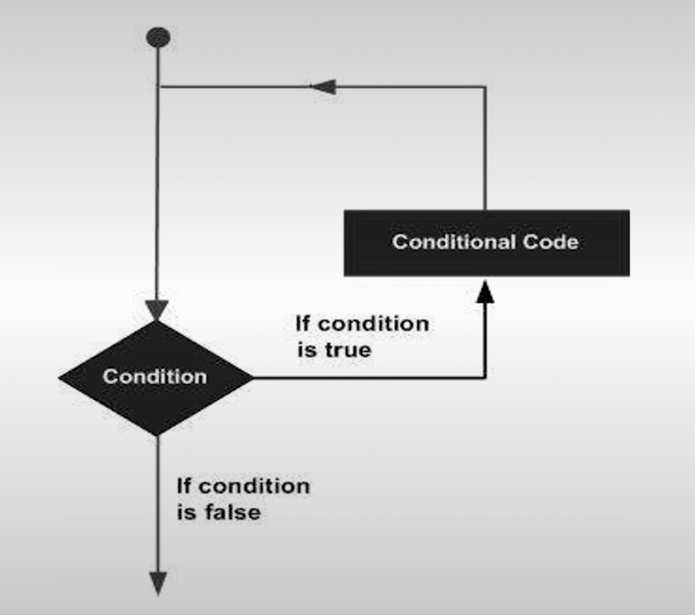
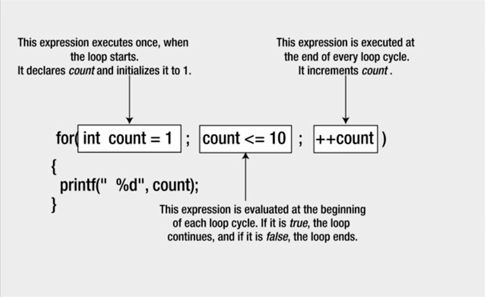

# 05-Control_Flow

## Overview

The statements inside your source files are generally executed from top to bottom, in the order that they appear.

Control flow statements, however, break up the flow of execution by employing decision making, looping, and branching, enabling your program to conditionally execute particular blocks of code:

* Decision-making statements (if-then, if-then-else, switch, goto)
* Looping statements (for, while, do-while)
* branching statements (break, continue, return)

### Decision Making

Structures require that the programmer specify one or more conditions to be evaluated or tested by the program. If a condition is true then a statement or statements are executed. If a condition is false then other statements are executed.



| Statement            | Description                                                                                                              |
| -------------------- | ------------------------------------------------------------------------------------------------------------------------ |
| If statements        | An if statement consists of a boolean expression followed by one or more statements.                                     |
| if…else statement   | An if statement can be followed by an optional else statement, which executes<br />when the boolean expression is false. |
| nested if statements | You can use one if or else if statement inside another if or else if statement(s)                                        |

### Repeating Code

There may be a situation, when you need to execute a block of code several number of times: the statements are executed sequentially: The first statement in a function is executed first, followed by the second, and so on.

A loop statement allows us to execute a statement or a group of statements multiple times.

**Loop control statements** change execution from its normal sequence. When execution leaves a scope, all automatic objects that were created in that scope are destroyed (break and continue). A loop becomes infinite loop if a condition never becomes false. The **for** loop is traditionally used for this purpose.



| Loop Type       | Description                                                                                                                               |
| --------------- | ----------------------------------------------------------------------------------------------------------------------------------------- |
| while loop      | It repeats a statement or a group of statements while a given condition is true. It tests the condition before executing the loop body. |
| for loop        | It executes a sequence of statements multiple times and abbreviates the code that manages the loop variable.                             |
| do...while loop | It is similar to a while statement, except that it tests the condition at the end of the loop body.                                      |
| nested loops    | You can use one or more loop inside any another while, for or do..while loop.                                                            |

## If Statements

### If statement

The C programming language provides a general decision-making capability in the form of a if statement.

if (expression)
program statement

translating a statement such as "If it is not raining, then I will go swimming" into the C language is easy

if ( it is not raining )
I will go swimming

The if statement is used to stipulate execution of a program statement/s based upon specified conditions, eg. I will go swimming if it is not raining.

```c
int score = 95;
int big = 90;

// simple statement if, no brackets
if (score > big)
printf("Jackpot!\n");

// compound statement if, the curly brackets are required for compound statements inside the if block.
if (score > big)
{
score++;
printf("You win\n");
}
```

### If with an else

You can extend the if statement with a small addition that gives you a lot more flexibility:

If the rain today is worse than the rain yesterday,
I will take my umbrella.
Else
I will take my jacket.
Then I will go to work.

This is exactly the kind of decision making the if-else statement provides:
If(expression)
Statement1;
else
Statement2;

```c
 // Program to determine if a number is even or odd

#include <stdio.h>

int main ()
{
	int number_to_test, remainder;

	printf ("Enter your number to be tested: ");
	scanf ("%i", &number_to_test);
	remainder = number to test % 2;

	if ( remainder == 0 ){
		printf ("The number is even.\n");
	}
	else{
		printf ("The number is odd. \n");
	}
	return O;
}
```

### else if

You can handle additional complex decision making by adding an if statement to your else clause

if (expression 1 )
	program statement 1
else
	if (expression 2 )
		program statement 2
	else
		program statement 3

The above extends the if statement from a two-valued logic decision to a three-valued logic decision, formatted using the else if construct.

if ( expression 1 )
	program statement 1
else if ( expression 2 )
	program statement 2
else
	program statement 3

```c
// Program to implement the sign function

#include <stdio.h>

int main (void)
{
	int number, sign;

	print ("Please type in a number: ");
	scanf ("%i", &number);

	if ( number < 0 )
		sign =-1;
	else if ( number == 0 )
		sign = 0;
	else // Must be positive
		sign = 1;

	printf ("Sign = %i\n", sign);

	return 0;
}
```

### nested If-else statement

A nested if-else statement means you can use one if or else if statement inside another if or else if statement(s)

if ( boolean expression 1) {

    /\* Executes when the boolean expression 1 is true \*/
	if(boolean expression 2) {
	/\* Executes when the boolean expression 2 is true \*/
    }
}

```c
if ( gamelsOver == 0 )
	if ( playerToMove == YOU )
		printf ("Your Move\n");
	else
		printf ("My Move\n");
else
	printf ("The game is over\n");
```

### The conditional operator (ternary statement)

The conditional operator is a unique operator, it's unlike all other operators in C. Most operators are either unary or binary operators. The conditional operatorI is a ternary operator (takes three operands).

The two symbols that are used to denote this operator are the question mark (?) and the colon (:). The first operand is placed before the ?, the second between the ? and the :, and the third after the: .

eg. condition ? expression1 : expression2

The conditional operator evaluates to one of two expressions, depending on whether a logical expression evaluates true or false. Notice how the operator is arranged in relation to the operands. The ? character follows the logical expression, condition. On the right of ? are two operands, expression1 and expression2, that represent choices. The value that results from the operation will be the value of expression1 if condition evaluates to true, or the value of expression2 if condition evaluates to false.

Conditional operator (example)

```c
x = y > 7 ? 25 : 50; //results in x being set to 25 if y is greater than 7, or to 50 otherwise
```

Same as:

```c
if(y＞7)
	x = 25:
else
	x = 50;
```

An expression for the maximum or minimum of two variables can be written very simply using the conditional operator.

## Switch Statement

The conditional operator and the if else statements make it easy to write programs that choose between two alternatives. However, many times a program needs to choose one of several alternatives. You can do this by using if else if ... else, but it is tedious and prone to errors. When the value of a variable is successively compared against different values use the switch statement, because it is more convenient and efficient.

switch ( expression)
{
	case value 1:
		program statement
   		 ...
	break;
	case valuen:
		program statement
		program statement
   		 ...
   	break;
	default:
		program statement
		break;
}

The expression enclosed within parentheses is successively compared against the values: value1, value2, ..., valuen. Cases must be simple constants or constant expressions. If a case is found whose value is equal to the value of expression then the statements that follow the case are executed. When more than one statement is included, they do not have to be enclosed within braces.

The break statement signals the end of a particular case and causes execution of the switch statement to be terminated. You should include the break statement at the end of every case. Forgetting to do so for a particular case causes program execution to continue into the next case.

The special optional case called default is executed if the value of expression does not match any of the case values. It is same as a"fall through" else.

```c
enum Weekday {Monday, Tuesday, Wednesday, Thursday, Friday, Saturday, Sunday};
enum Weekday today = Monday;
switch(today)
{
 case Sunday:
	printf("Today is Sunday.");
	break;
 case Monday:
	printf("Today is Monday.");
	break;
 case Tuesday:
	printf("Today is Tuesday.");
	break;
default:
	printf("whatever");
	break;
}
```

Another example

```c
#include <stdio.h>
int main (void)
{
	float value1, value2;
	char operator;

	printf ("Type in your expression.\n");
	scanf ("%f %c %f", &value1, &operator, &value2);

	switch (operator)
	{
		case '+':
			printf ("%.2f\n", value1 + value2);
			break;
		case '-':
			printf ("%.2fn", value1 - value2);
			break;
		case '*':
			printf ("%.2fn", value1 * value2);
			break;
		case "/":
			if (value2 == 0 )
			printf ("Division by zero.\n");
			else
			printf ("%.2fn", value1 / value2);
			break;
		default:
			printf ("Unknown operator.In");
			break;
	}

	return 0;
}
```

## goto statement

The goto statement is available in C. There are two parts to the goto statement -the goto and a label name. Label is named following the same convention used in naming a variable.

goto part2;

For the above to there must be another statement bearing the part2 label.

You should never need to use the goto statement. If you have a background in older versions of FORTRAN or BASIC, you might have developed programming habits that depend on using goto.

Form:
goto label;

.

.

.

label : statement

```c
top : ch = getchar();
    .
    .
    .
if (ch != 'y')
goto top;
```

## for loop

Repeating code: you can repeat a block of statements until some condition is met or a specific number of times. Repeating code without a condition is a forever/infinite loop.

There are two types of loops:

* Counter controlled loop: the number of times that a loop is repeated can be controlled simply by a count, repeating the statement block a given number of time
* Sentiner control loop: the number of times that a loop is repeated can depend on when a condition is met or until the user entering "quit"

### for loop

Used to execute a block of statements a given number of times.

If you want to display the numbers from 1 to 10, instead of writing ten statements that call printf(), you would use a for loop, eg.

```c
for(int count = 1 ; count <= 10 ; ++count)
{
printf(" %d", count);
}
```

The for loop operation is controlled by what appears between the parentheses that follow the keyword for. The three control expressions that are separated by semicolons control the operation of the loop.The action that you want to repeat each time the loop repeats is the block containing the statement that calls printf() (body of the loop).For single statements, you can omit the braces.

The general pattern for the for loop is:

for(starting condition; continuation condition ; action_per_iteration)
loop statement;

The statement to be repeated is represented by loop_statement. It could equally well be a block of several statements enclosed between braces.

The starting_condition usually (but not always) sets an initial value to a loop control variable. The loop control variable is typically a counter of some kind that tracks how often the loop has been repeated. You can also declare and initialize several variables of the same type here with the declarations separated by commas. Variables will be local to the loop and will not exist once the loop ends.

The continuation condition is a logical expression evaluating to true or false. It determines whether the loop should continue to be executed. As long as this condition has the value true, the loop continues. This will typically checks the value of the loop control variable. You can put any logical or arithmetic expression here as long as you know what you are doing. The continuation_condition is tested at the beginning of the loop rather than at the end. What this means is that the loop statement will not be executed at all if the continuation condition starts out as false.

The action_per_iteration is executed at the end of each loop iteration. It is usually an increment or decrement of one or more loop control variables. You can modify several variables here, just need to use commas to separate.

```c
for(int i=1,j=2; i<=5; ++1, j=j+2)
printf(" %5d", i*j);
//The output produced by this fragment will be the values 2, 8, 18, 32, and 50 on a single line
```



```c
unsigned long long sum = 0LL; //Stores the sum of the integers
unsigned int count = 0; //The number of integers to be summed

//Read the number of integers to be summed
printf("\nEnter the number of integers you want to sum: ");
scanf(" %u", &count);

//Sum integers from 1 to count
for(unsigned int i = 1; i <= count; ++i)
Sum += i;

//OR
//for(unsigned int i = 1 ; i <= count; sum += i++);
//printf("\n Total of the first %u numbers is %llu\n", count, sum);
```

### Infinite loop

You have no obligation to put any parameters in the for loop statement.

for( ;; )
{
/* statements */
}

The condition for continuing the loop is absent, the loop will continue indefinitely. Sometimes it is useful for monitoring data or listening for connections.

## While and Do-While loops

### While loop

The While loop is the mechanism for repeating a set of statements allows execution to continue for as long as a specified logical expression evaluates to true.

While this condition is true
Keep on doing this

OR

While you are hungry
Eat sandwiches

The general syntax for the while loop is as follows (one statement in body):

while( expression)
statement1;

or

while (expression)
{
statement1;
statement2;
}

pre-test loop: the condition for continuation of the while loop is tested at the start (top of the loop)

If expression starts out false, none of the loop statements will be executed. If you answer the first question "No, I'm not hungry,' then you don't get to eat any sandwiches at all, and you move straight to the coffee. If the loop condition starts out as true, the loop body must contain a mechanism for changing this if the loop is to end.

Counter Controlled While loop Example

```c
//Program to introduce the while statement

#include <stdio.h>

int main (void)
{
	int count = 1;

	while ( count <= 5 ) {
		printf ("%i\n", count);
		++count;
	}

	return O;
}
```

Logic controlled while loop example

```c
int num = 0;
scanf("%d", &num);

while (num != -1)
{
	/* loop actions */
	scanf("%d", &num);
}
```

### do-while loop

In the while loop, the body is executed while the condition is true, while the do-while loop is a loop where the body is executed for the first time unconditionally. The do-while loop, because the test is at the bottom, always guaranteed to execute at least once. The condition to test the exit is at the bottom (post-test loop / exit controlled loop). After initial execution, the body is only executed while the condition is true.

do
	statement
while (expression);

or

do
{
	prompt for password
	read user input
} while (input not equal to password);

```c
do
	scanf("%d", &number);
while (number != 20);

//Or counter controlled

int number = 4;
do
{
	printf("\nNumber = %d", number);
	number++;
}
while (number < 4);
```

### which loop to use

First, decide whether you need an pre or post test loop. For the most part when you decide what loop to use, it usually will be a pre test loop (for or while), a bit better option in most cases. It is better to check that condition at the top before you leap (or loop) than after.  It is easier to read if the loop test is found at the beginning of the loop. In many uses, it is important that the loop be skipped entirely if the test is not initially met.

So, should you use a for or a while? It is a matter of taste, because what you can do with one, you can do with the other.

To make a for loop like a while, you can omit the first and third expressions:

for ( ;test; )                              is the same as                         while (test)

To make a while like a for, preface it with an initialization and include update statements

initialize;
while (test)
{
	body;
	update;
}

is the same as

for (initialize; test; update)
	body;

A for loop is appropriate when the loop involves initializing and updating a variable. A while loop is better when the conditions are otherwise. Jason usually uses the while loop for logic controlled loops and the for loop for counter controlled loops:

```c
while (scanf("%l)", &num) == 1)

for (count = 1; count <= 100; count++)
```

## Nested Loops

Sometimes you may want to place one loop inside another.

You might want to count the number of occupants in each house on a street. So what you would do is you wanna have an outer loop where you step from house to house, and for each house you count the number of occupants. Going through all the houses could be an outer loop, and for each iteration of the outer loop you would have an inner loop that counts the occupants.

### for loop inside of a for loop

```c
for(int i = 1 ; i <= count; ++i)
{
	sum = 0; // Initialize sum for the inner loop

// Calculate sum of integers from 1 to i
	for(int j= 1;j<= i; ++j)
		sum +=j;
	printf("'\n%d\t%d", i, sum); // Output sum of 1 to i
}
```

### while loop inside of a for loop

```c
for(int i = 1 ; i <= count; ++i)
{
	sum = 1;  // Initialize sum for the inner loop
	j = 1;  // Initialize integer to be added
	printf("\n1");

// Calculate sum of integers from 1 to i
	while(j<i)
	{
		sum += ++j;
		printf(" + %d", j);  // Output +j - on the same line
	}
	printf(" = %d", sum);  // Output = sum
}
```

### Continue statements

Sometimes a situation arises where you do not want to end a loop, but you want to skip the current iteration.

The continue statement in the body of a loop does this. All you need to do is use the keyword "continue;" in the body of the loop.

An advantage of using continue is that it can sometimes eliminate nesting or additional blocks of code. It can enhance readability when the statements are long or are deeply nested already. Don't use continue if it complicates rather than simplifies the code.

```c
enum Day { Monday, Tuesday, Wednesday, Thursday, Friday, Saturday, Sunday};

for(enum Day day = Monday; day<= Sunday ; ++day)
{
	if(day == Wednesday)
	continue;

	printf("It's not Wednesday!\n");
	/* Do something useful with day */
}
```

### Break statement

Normally, after the body of a loop has been entered, a program executes all the statements in the body before doing the next loop test. The break statement causes the program to immediately exit from the loop it is executing. Statements in the loop are skipped, and execution of the loop is terminated. If the break statement is inside nested loops, it affects only the innermost loop containing it.

The break statement uses the keyword "break;". Break is often used to leave a loop when there are two separate reasons to leave.

Break is also used in switch statements.

```c
while (p > 0)
{
	printf("%d\n", p);
	scanf("%d", &q);
	while( q > 0)
	{
		printf("%dIn",p*q);
		if (q > 100)
			break; // break from inner loop
		scanf("%d", &q);

	}
	if (q > 100)
		break; // break from outer l00p
	scanf("%d", &p);
}
```
