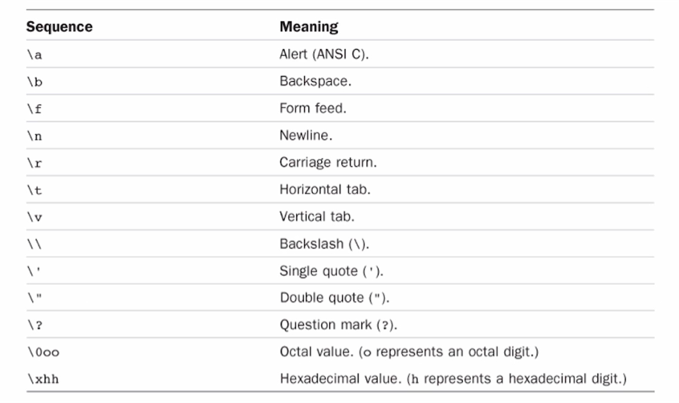
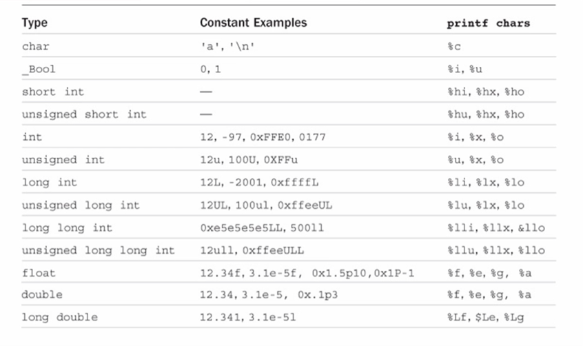

# 05-Variables_and_Data_Types

Remember that a program needs to store the instructions of its program and the data that it acts upon while your computer is executing that program. This information is stored in memory (RAM). RAM's contents are lost when the computer is turned off. Hard drives store persistent data.

You can think of RAM as an ordered sequence of boxes. The box is full when it represents 1 or the
box is empty when it represents 0. Each box represents one binary digit, either 0 or 1 (true and false). Each box is called a **bit**. Bits in memory are grouped into sets of eight (**byte**). Each byte has been labeled with a number (address). The address of a byte uniquely references that byte in your computer's memory. Again, **memory consists of a large number of bits that are in groups of eight (called bytes) and each byte has a unique address.**

## Variables

The true power of programs you create is their manipulation of data, so we need to understand the different data types you can use, as well as how to create and name variables.

**Constants** are types of data that do not change and retain their values throughout the life of the program. **Variables** are types of data may change or be assigned values as the program runs. Variables are the names you give to computer memory locations which are used to store values in a computer program.

For example, assume you want to store two values 10 and 20 in your program and at a later stage, you want to use these two values:

* Create variables with appropriate names
* Store your values in those two variables
* Retrieve and use the stored values from the variables

### Naming Variables

The rules for naming variables in C is that all names must begin with a letter or underscore (_) and can be followed by any combination of letters (upper-or lowercase), underscores, or the digits
0-9, e.g. Jason, myFlag, i, 15x7, my_data, _anotherVariable

The below lists some examples of invalid variable names:
~~temp\$value~~ - $ is not a valid character
~~my flag~~ -  embedded spaces are not permitted
~~3Jason~~ - variable names cannot start with a number
~~int~~ - int is a reserved word

Use meaningful names when selecting variable names, because they can dramatically increase the readability of a program and pay off in the debug and documentation phases.

#### Data Types

Some types of data in programs are numbers, letters or words. Computer needs a way to identify and use these different kinds. A data type represents a type of the data which you can process using your program, examples include ints, floats, doubles, etc, also correspond to byte sizes on the platform of your program. **Primitive data types** are types that are not objects and store all sorts of data.

### Declaring Variables

Declaring a variable is when you specify the type of the variable followed by the variable name. It specifies to the compiler how a particular variable will be used by the program.

For example, the keyword **int** is used to declare the basic integer variable. First comes int, and then the chosen name of the variable, and then a semicolon: *type-specifier variable-name;* to declare more than one variable, you can declare each variable separately, or you can follow the int with a list of names in which each name is separated from the next by a comma. C requires that all program variables be declared before they are used in a program.

```
int x;
```

```
int x, y, z;
```

The above creates variables but does not provide values for them. We can assign a variable a value by using the = operator.

```
x=112;
```

### Initializing Variables

To initialize a variable means to assign it a starting, or initial, value. Initialization can be done as part of the declaration: follow the variable name with the assignment operator (=) and the value you want the variable to have

```
int x = 21;
```

```
int y = 32, z= 14;
```

```
int x, z = 94;   
/* 
valid, but poor, form 
Only z is initialized. 
It is best to avoid putting initialized and noninitialized variables in the same declaration statement. 
*/
```

## Data Types

We understand that C supports many different types of variables and each type of variable is used for storing kind of data:

* types that store integers
* types that store nonintegral numerical
  values
* types that store characters

Some examples of basic data types in C are: *int*; *float*; *double*; *char*; *_Bool*. The difference between the types is in the amount of memory they occupy and the range of values they can hold. The amount of storage that is allocated to store a particular type of data. It depends on the computer you are running(machine-dependent). An integer might take up 32 bits on your computer, or perhaps it might be stored in 64.

### int

A variable of type *int* can be used to contain integral values only (values that do not contain decimal places). A minus sign preceding the data type and variable indicates that the value is negative. The int type is a **signed** integer. It must be an integer and it can be positive, negative, or zero. If an integer is preceded by a zero and the letter x (either lowercase or uppercase), the value is taken as being expressed in hexadecimal (base 16) notation.

```
int rgbColor = OxFFEFOD;
```

The values 158, -10, and 0 are all valid examples of integer constants. No embedded spaces are permitted between the digits. Values larger than 999 cannot be expressed using commas (12,000 must be written as 12000).

### float

A variable to be of type *float* can be used for storing floating-point numbers (values containing decimal places). The values 3., 125.8, and -.0001 are all valid examples of floating-point constants that can be assigned to a variable. **Floating-point constants can also be expressed in scientific notation**. 1.7e4 is a floating-point value expressed in this notation and represents the value 1.7 × 10 to the power of 4.

To explicitly express a float constant, append either an f or F to the end of the number: 12.56f

### double

The double type is the same as type float, only with roughly twice the precision. It's used whenever the range provided by a float variable is not sufficient.  It can store twice as many significant digits. Most computers represent double values using 64 bits. All floating-point constants are taken as double values by the C compiler.

### _Bool

The _Bool data type can be used to store just the values 0 or 1. It's used for indicating an on/off, yes/no, or true/false situation (binary choices). _Bool variables are used in programs that
need to indicate a Boolean condition. A variable of this type might be used to indicate whether all data has been read from a file.

* 0 is used to indicate a false value
* 1 indicates a true value

C89 _Bool; C99 bool

```
#include<stdio.h>
#include<stdbool.h>

int main()
{
  bool myBoolean = true;
}
```

### Example

```
#include<stdio.h>

int main(void)
{
  int integerVar = 100;
  float floatingVar = 331.79;
  double doubleVar = 8.44e+11;

  _Bool boolVar = 0;

  return 0;
}
```

### Other Data Types

The int type will probably meet most of your integer needs when beginningin C. However, C offers many other integer types. It gives the programmer the option of matching a type to a particular use case. Integer types vary in the range of values offered and in whether negative numbers can be used.

C offers three adjective keywords to modify the basic integer type (can also be used by itself): **short, long, and unsigned**. The type short int, or short may use less storage than int, thus saving space when only small numbers are needed. It can be used when the program needs a lot of
memory and the amount of available memory is limited. The type long int, or long, may use more
storage than int, thus enabling you to express larger integer values. The type long long int, or long long may use more storage than long. A constant value of type long int is formed by optionally appending the letter L (upper-or lowercase) onto the end of an integer constant.

```
long int numberOfPoints = 131071100L;
```

Type specifiers can also be applied to doubles

```
long double US_deficit_2017;
```

A long double constant is written as a floating constant with the letter I or L immediately following, e.g. 1.234e+71

The type unsigned int, or unsigned, is used for variables that have only nonnegative values (positive). unsigned int counter; the accuracy of the integer variable is extended.

The keyword signed can be used with any of the signed types to make your intent explicit. short, short int, signed short, and signed short int are all names for the same type.

### Enums

A data type that allows a programmer to define a variable and specify the valid values that could be stored into that variable. You could create a variable named "myColor" and it can only contain one of the primary colors, red, yellow, or blue, and no other values.

Your first have to define the enum type and give it a name:

* initiated by the keyword enum
* then the name of the enumerated data type
* then list of identifiers (enclosed in a set of curly braces) that define the permissible values that can be assigned to the type

```
enum primaryColor { red, yellow, blue };
```

Variables declared to be of this data type can be assigned the values red, yellow, and blue inside the program, and no other values. To declare a variable to be of type enum primaryColor:

* use the keyword enum
* followed by the enumerated type name
* followed by the variable list. So the statement

```
enum primaryColor myColor, gregsColor;
```

It defines the two variables myColor and gregsColor to be of type primaryColor. The only permissible values that can be assigned to these variables are the names red, yellow, and blue.

```
myColor = red;
```

Another example:

```
enum month { January, February, March, April, May, June, July, August, September, October, November, December };
```

#### Enums as ints

The compiler actually treats enumeration identifiers as integer constants. First name in list is 0.

```
enum month thisMonth;
thisMonth = February;
```

The value 1 is assigned to thisMonth (and not the name February) because it is the second identifier listed inside the enumeration list.

If you want to have a specific integer value associated with an enumeration identifier, the integer can be assigned to the identifier when the data type is defined.

```
enum direction { up, down, left = 10, right};
```

An enumerated data type direction is defined with the values up, down, left, and right. up = 0 because it appears first in the list. 1 to down because it appears next. 10 to left because it is explicitly assigned this value. 11 to right because it appears immediately after left in the list.

### Char

Chars represent a single character such as the letter 'a', the digit character '6', or a semicolon(';'). Character literals use single quotes such as 'A' or 'Z'. You can also declare char variables to be unsigned. It also can be used to explicitly tell the compiler that a particular variable is a signed quantity.

#### Declaring a char

```
char broiled;		/* declare a char variable */
broiled = 'T';		/* OK */
```

~~broiled = T;~~		/\* NO! Thinks T is a variable \*/
If you omit the quotes, the compiler thinks that T is the name of a variable
~~broiled = "T";~~		/\* NO! Thinks "T" is a string \*/
If you use double quotes, it thinks you are using a string

You can also use the numerical code to assign values

```
char grade = 65;        /* ok for ASCII, but poor style */
```

#### Escape Characters

C contains special characters that represent actions:

* backspacing
* going to the next line
* making the terminal bell ring (or speaker beep)

We can represent these actions by using special symbol sequences, called **escape sequences**. Escape sequences must be enclosed in single quotes when assigned to a character variable.

```
char x = '\n';
```

And then print the variable x to advance the printer or screen one line.



## Format Specifiers

Format specifiers are used when displaying variables as output. They specify the type of data of the variable to be displayed.

```
int sum = 89;
printf("The sum is %d\n", sum);
```

The printf() function can display as output the values of variables. It has two items or arguments enclosed within the parentheses. The arguments are separated by a comma. First argument to the printf() routine is always the character string to be displayed, along with the display of the character string, you might also frequently want to have the value of certain program variables displayed. The percent character inside the first argument is a special character recognized by the printf() function. The character that immediately follows the percent sign specifies what type of value is to be displayed.

### Example

```
#include <stdio.h>

int main (void)
{
  int integerVar = 100;
  float floatingVar=331.79;
  double doubleVar = 8.44e+11;
  char charVar = 'W';
  _Bool boolVar = 0;

  printf ("integerVar = %i\n", integerVar);
  printf ("floatingVar = %f\n", floatingVar);
  printf ("doubleVar = %e\n", doubleVar);
  printf ("doubleVar = %g\n", doubleVar);
  printf ("charVar = %c\n", charVar);
  printf ("boolVar = %i\n", boolVar);

  return 0;
}
```

```
float x = 3.93232323;
printf("%.5f", x); //3.93232
```

### Summary



## Command Line Arguments

There are times when a program is developed that requires the user to enter a small amount of information at the terminal. This information might consist of a number indicating the
triangular number that you want to have calculated or a word that you want to have looked up in a dictionary. Two ways of handling this:

* Requesting the data from the user
* supply the information to the program at the time the program is executed (command-line arguments)

We know that the main() function is a special function in C. It is basically the entry point of the program. When main() is called by the runtime system, two arguments are actually passed to the function:

* the 1st argument (**argc** for argument count) is an integer value that specifies the number of arguments typed on the command line
* the 2nd argument (**argv** for argument vector) is an array of character pointers (strings)

The first entry in this array is a pointer to the name of the program that is executing.

```
int main (int argc, char *argvi[])
{
  int numberOfArguements = argc;
  char *arguement1 = argv[0];
  char *arguement2 = argv[1];

  printf("Number of Arguements: %d\n", numberOfArguements);
  ptintf("Arguement 1 is the program name: %s\n", arguement1);
  printf("Arguement 2 is the command line arguement: %s", arguement2);

  return 0;
}
```
