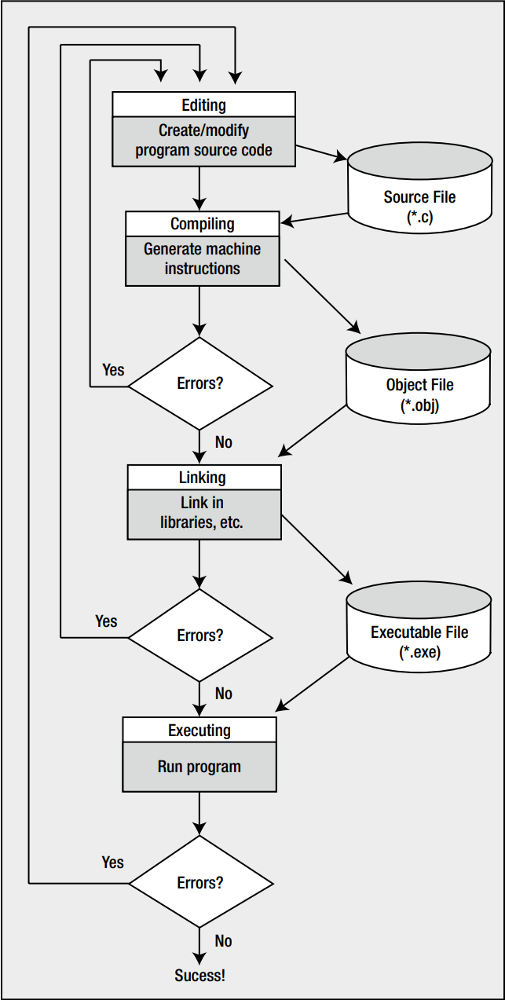
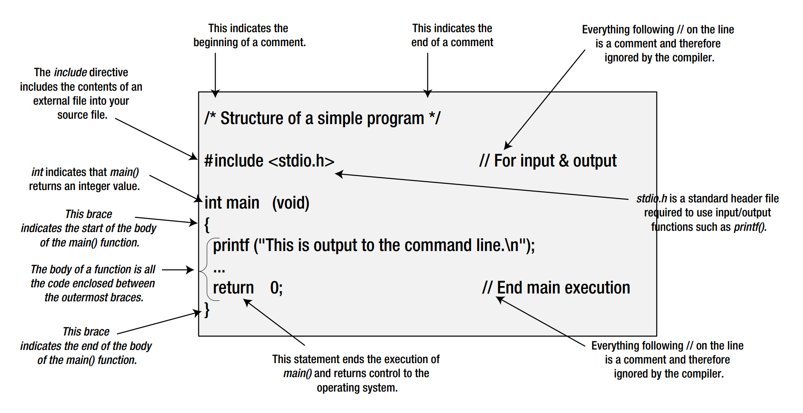

# Chapter01-Programming_in_C

## The Standard Library

The standard library defines constants, symbols, and functions that you frequently need when writing a C program. It also provides some optional extensions to the basic C language.

The standard library is specified in a set of standard files called header files. Header files always have names with the extension .h. To make a particular set of standard features available in your C program file, you just include the appropriate standard header file in a way that I' ll explain later in this chapter. Every program you write will make use of the standard library.

## Creating C Programs

There are four fundamental stages, or processes, in the creation of any C program:

* Editing
* Compiling
* Linking
* Executing



## Dealing with Errors

To err is human, so there's no need to be embarrassed about making mistakes.

Don't get put off by the number of errors reported. After you consider the messages carefully, the basic approach is to go back and edit your source code to fix at least the first error, because that may have triggered other errors, and ignore the errors you can't understand. Then have another go at compiling the source file. With luck, you'll get fewer errors the next time around.

## Dissecting a Simple Program

```c
/* Program 1.2 Your Second C Program */
#include<stdio.h>
int main(void)
{
 printf("\"If at first you don't succeed, try, try, try again!\"");
 return 0;
}
```

### Comments

Anything between /* and */ is treated as a comment. As soon as your compiler finds /\* in your source file, it will simply ignore anything that follows (even if the text looks like program code) until it finds a matching */ that marks the end of the comment. If you forget to include the matching \*/, everything following \*/ will be ignored. Here’s how you could use a single comment to identify the author of the code and to assert your copyright:

```c
/*
 * Written by Ivor Horton
 * Copyright 2012
*/
```

You can also embellish comments to make them stand out:

```c
/*******************************************
 * This is a very important comment *
 * so please read this. *
 *******************************************/
```

You can add a comment at the end of a line of code using a different notation, like this:

```c
printf("Beware the Ides of March!"); // This line displays a quotation
```

Everything following two forward slashes on a line is ignored by the compiler. This form of comment is less cluttered than the previous notation, especially when the comment is on a single line.

### Preprocessing Directives

```c
#include <stdio.h> // This is a preprocessor directive
```

The symbol # indicates this is a preprocessing directive, which is an instruction to your compiler to do something before compiling the source code. The compiler handles these directives during an initial preprocessing phase before the compilation process starts. There are quite a few preprocessing directives, and there are usually some at the beginning of the program source file, but they can be anywhere.

In this case, the compiler is instructed to “include” in your program the contents of the file with the name stdio.h. This file is called a header file, because it's usually included at the head of a program source file.

In this case the header file defines information about some of the functions that are provided by the standard C library but, **ingeneral, header files specify information that the compiler uses to integrate any predefined functions or other global objects within a program.** You'll be creating your own header files for use with your programs.

In this case, because you're using the printf() function from the standard library, you have to include the stdio.h header file. This is because stdio.h contains the information that the compiler needs to understand what printf() means, as well as other functions that deal with input and output. As such, its name, **stdio, is short for standard input/output.**

All header files in C have file names with the extension .h.

Header file names are case sensitive on some systems, so **you should always write them in lowercase in #include directives.**

### Defining the main() Function

The next five statements define the function main():

```c
int main(void) 				// This identifies the function main()
{ 					// This marks the beginning of main()
 printf("Beware the Ides of March!");   // This line outputs a quotation
 return 0; 				// This returns control to the operating system
} 					// This marks the end of main()
```

A function is just a named block of code between braces that carries out some specific set of operations. Every C program consists of one or more functions, and **every C program must contain a function called main()—the reason being that a program always starts execution from the beginning of this function.**

The first line of the definition for the function main() is as follows:

```c
int main(void) 				// This identifies the function main()
```

This defines the start of main(). Notice that there is no semicolon at the end of the line. The first line identifying this as the function main() has the word int at the beginning. What appears here defines the type of value to be returned by the function, and the word int signifies that main() returns an integer value. The integer value that is returned when the execution of main() ends represents a code that is returned to the operating system that indicates the program state. You end execution of main() and specify the value to be returned in this statement:

```c
return 0; 				// This returns control to the operating system
```

This is a return statement that **ends execution of main()** and returns the value 0 to the operating system. You return a **zero value** from main() **to indicate that the program terminated normally**; a **nonzero value** would indicate an **abnormal** return, which means things did not proceed as they should have when the program ended.

The parentheses that immediately follow the name of the function main enclose a definition of what information is to be transferred to main() when it starts executing. In this example, there's the word void between the parentheses, and this signifies that no data can be transferred to main().

The main() function can call other functions, which in turn may call further functions, and so on. For every function that's called, you have the opportunity to pass some information to it within the parentheses that follow its name. A function will stop execution when a return statement in the body of the function is reached, and control will then transfer to the calling function (or the operating system in the case of the function main()).

### Keywords

In C, a keyword is a word with special significance, so you must not use keywords for any other purpose in your program. For this reason, keywords are also referred to as **reserved words**, e.g. int, void, return.

### The Body of a Function

.png)

The function body is the bit between the opening and closing braces that follows the line where the function name appears. The function body contains all the statements that define what the function does. The example's main() function has a very simple function body consisting of just two statements:

```c
/************Style Type One************/
{ 					// This marks the beginning of main()
 printf("Beware the Ides of March!");   // This line outputs a quotation
 return 0; 				// This returns control to the operating system
} 					// This marks the end of main()
```

```c
/************Style Type Two************/
int main(void) {
 printf("Beware the Ides of March!");    // This line outputs a quotation
 return 0;
}
```

Every function must have a body, although the body can be empty and just consist of the opening and closingbraces without any statements between them. In this case, the function will do nothing.

You may wonder what use a function that does nothing is? Actually, this can be very useful when you're developing a program that will have many functions. **You can declare the set of (empty) functions that you think you'll need to write to solve the problem at hand, which should give you an idea of the programming that needs to be done, and then gradually create the program code for each function. This technique helps you to build your program in a logical and incremental manner.**

### Outputting Information

The body of the main() function in the example includes a statement that calls the printf() function:

```c
printf("Beware the Ides of March!"); // This line outputs a quotation
```

As I've said, printf() is a standard library function, and it outputs information to the command line (actually the *standard output stream*, which is the command line by default) based on what appears between the parentheses that immediately follow the function name. In this case, the call to the function displays the simple piece of Shakespearean advice that appears between the double quotes; a string of characters between double quotes like this is called a *string literal*. Notice that this line does end with a semicolon.

### Function Arguments

Items enclosed between the parentheses following a function name, as with the printf() function in the previous statement, are called *arguments*, and they specify data that are to be passed to the function. When there is more than one argument to a function, they must be separated by commas.

### Control Characters

```c
// Program 1.4 Another Simple C Program - Displaying a Quotation
#include <stdio.h>
int main(void)
{
 printf("My formula for success?\nRise early, work late, strike oil.\n");
 return 0;
}
```

Look at the printf() statement. After the first sentence and at the end of the text, you've inserted the characters \n. The combination \n is another escape sequence that represents a newline character. This causes the output cursor to move to the next line, so any subsequent output will start on a new line.

The backslash (\) is always of special significance in a text string because it indicates the start of an escape sequence. The character following the backslash indicates what character the escape sequence represents. **In the case of \n, it's n for newline,** but there are plenty of other possibilities. Because a backslash itself is of special significance, you need a way to specify a backslash in a text string. To do this, you simply use two backslashes: \\\ .

```c
// Program 1.5 Another Simple C Program - Displaying Great Quotations
#include <stdio.h>
int main(void)
{
 printf("\"It is a wise father that knows his own child.\"\nShakespeare\n");
 return 0;
}
```

The double quotes are output because you use escape sequences for them in the string. Shakespeare appears on the next line because there is a \n escape sequence following the \\".

| Escape sequence | Description                      |
| --------------- | -------------------------------- |
| \n              | Represents a newline character   |
| \r              | Represents a carriage return     |
| \b              | Represents a backspace           |
| \f              | Represents a form-feed character |
| \t              | Represents a horizontal tab      |
| \v              | Represents a vertical tab        |
| \a              | Inserts a bell (alert) character |
| \\\?            | Inserts a question mark (?)      |
| \\"             | Inserts a double quote (")       |
| \\'             | Inserts a single quote (')       |
| \\\             | Inserts a backslash (\\)         |

### Trigraph Sequences

In general you can use a question mark directly in a string. The \\? escape sequence only exists because there are nine special sequences of characters called trigraph sequences that are three-characters sequences for representing each of the characters #, [ , ], | \, ^, ~, \\, {, and }:

| ??= converts to # | ??( converts to [ | ??) converts to ] |
| ----------------- | ----------------- | ----------------- |
| ??/ converts to \ | ??< converts to { | ??> converts to } |
| ??' converts to ^ | ??! converts to   | ??- converts to ~ |

These are there for when it is necessary to write C code in the International Organization for Standardization ISO
invariant code set, which does not have these characters. This is unlikely to apply to you. You can completely forget
about all this unless you want to write a statement such as:

```c
printf("What??!\n");		//What|
```

The trigraph ??! will be converted to |. 

Now the trigraph sequence does not appear because the second question mark is specified by its escape sequence. Your compiler may well issue a warning when you use a trigraph sequence because usually it is unintended.

## The Preprocessor

In the example I explained how you use a preprocessing directive to include the contents of a header file into your source file. The preprocessing phase of compilation can do much more than this. As well as directives, your source file can contain macros. A macro is an instruction to the preprocessor to add to or modify the C statements in the program. A macro can be something as simple as defining a symbol, such as INCHES_PER_FOOT to be replaced by 12 wherever the symbol appears. The directive to do this is:

```c
#define INCHES_PER_FOOT 12
```

With this directive at the beginning of your source file, wherever INCHES_PER_FOOT appears in the code, it will be replaced by 12. For example:

```c
printf("There are %d inches in a foot.\n", INCHES_PER_FOOT);
```

After preprocessing, this statement will be:

```c
printf("There are %d inches in a foot.\n", 12);
```

INCHES_PER_FOOT no longer appears because the symbol has been replaced by the string specified in the #define directive. This will happen for every instance of the symbol in the source file.

A macro can also be quite complicated, with significant amounts of code being added to a source file depending on specified conditions.

## Developing Programs in C

### Understanding the Problem

Even for a relatively straightforward problem, you need to know what kind of input to expect, how the input is to be processed, and what kind of output is required—and how it's going to look. The input could be entered with the keyboard, but it might also involve data from a disk file or information obtained over a telephone line or a network. The output could simply be displayed on the screen, or it could be printed; perhaps it might involve writing a new disk file updating an existing file.

For more complex programs, you'll need to look at many more aspects of what the program is going to do. A clear definition of the problem that your program is going to solve is an essential part of understanding the resources and effort that are going to be needed for the creation of a finished product. Considering these details also forces you to establish whether the project is actually feasible. A lack of precision and detail in the specifications for a new program has often resulted in a project taking much longer and costing much more than planned. There are many instances of projects being abandoned for this reason.

### Detailed Design

You need to specify what the program does by dividing it into a set of well-defined and manageable chunks that are reasonably self-contained. You also need to detail the way in which these chunks connect, as well as what information each chunk will need when it executes. This will enable you to develop the logic of each chunk relatively independently from the rest of the program. If you treat a large program as one huge process that you try to code as a single chunk, chances are that you'll never get it to work.

### Implementation

If a program is large and you are writing it all yourself, you'll write the source code one unit at a time. As one part is completed, you can write the code for the next. Each part will be based on the detailed design specifications, and you' ll verify that each piece works, as much as you can, before proceeding. In this way, you'll gradually progress to a fully working program that does everything you originally intended.

A large programming project usually involves a team of programmers. The project is divided into relatively self-contained units that can be allocated among the members of the team. This allows several units of code to be developed concurrently. The interface between one unit of code and the rest of the program must be precisely defined if the units are going to connect together as a whole.

### Testing

Each of your program modules—the pieces that make up your program—will need to be tested individually. When they don’t work properly, you need to debug them. Debugging
is the process of finding and correcting errors in your program. This term is said to have originated in the days when finding the errors in a program involved tracing where the information went and how it was processed inside the computer by using the circuit diagram for the machine. The story goes that in one instance it was discovered that a computer program error was caused by an insect shorting part of a circuit in the computer. The problem was caused by a bug. Subsequently, the term bug was used to refer to any error in a program.

With a simple program, you can often find an error simply by inspecting the code. In general, though, the process of debugging usually involves using a debugger that inserts code temporarily for working out what happened when things go wrong. This includes breakpoints where execution pauses to allow you to inspect values in your code. You can also step through a program a statement at a time. If you don’t have a debugger, adding extra program code to produce output that will enable you to check what the sequence of events is and what intermediate values are produced when a program executes. With a large program, you'll also need to test the program modules in combination because, although the individual modules may work, there's no guarantee that they'll work together! The jargon for this phase of program development is integration testing.

## Functions and Modular Programming

Most programming languages, including C, provide a way of breaking up a program into segments, each of which can be written more or less independently of the others. In C these segments are called functions. The program code in the body of one function is insulated from that of other functions. A function will have a specific interface to the outside world in terms of how information is transferred to it and how results generated by the function are transmitted back from it. This interface is specified in the first line of the function, where the function name appears.

Segmenting a program into manageable chunks is a very important aspect to programming, so let's go over the reasons for doing this:

* It allows each function to be written and tested separately. This greatly simplifies the process of getting the total program to work.
* Several separate functions are easier to handle and understand than one huge function.
* Libraries are just sets of functions that people tend to use all the time. Because they’ve been prewritten and pretested, you know that they work, so you can use them without worrying about their code details. This will accelerate your program development by allowing you to concentrate on your own code, and it's a fundamental part of the philosophy of C. The richness of the libraries greatly amplifies the power of the language.
* You can accumulate your own libraries of functions that are applicable to the sort of programs that you're interested in. If you find yourself writing a particular function frequently, you can write a generalized version of it to suit your needs and build this into your own library. Then, whenever you need to use that particular function, you can simply use your library version.
* In the development of large programs, which can vary from a few thousand to millions of lines of code, development can be undertaken by teams of programmers, with each team working with a defined subgroup of the functions that make up the whole program.

Note: In some other programming languages, the term *method* is used to refer to a self-contained unit of code. Thus method means essentially the same as function.

## Common Mistakes

Mistakes are a fact of life. When you write a computer program in C, the compiler must convert your source code to machine code. To do this, your code must have a precise meaning so there are very strict rules governing how you use the language. Leave out a comma where one is expected or add a semicolon where you shouldn’t and the compiler
won't be able to translate your program into machine code.

You'll be surprised just how easy it is to introduce typographical errors into your program, even after years of practice. If you're lucky, these errors will be picked up when you compile or link your program. If you're really unlucky, they can result in your program apparently working fine but producing some intermittent erratic behavior. You can end up spending a lot of time tracking these errors down.

Of course, it's not only typographical errors that cause problems. You'll often find that your detailed implementation is just not right. Where you're dealing with complicated decisions in your program, it's easy to get the logic wrong. Your program may be quite accurate from a language point of view, and it may compile and run without a problem, but it won't produce the right answers. These kinds of errors can be the most difficult to find.

## Points to Remember


