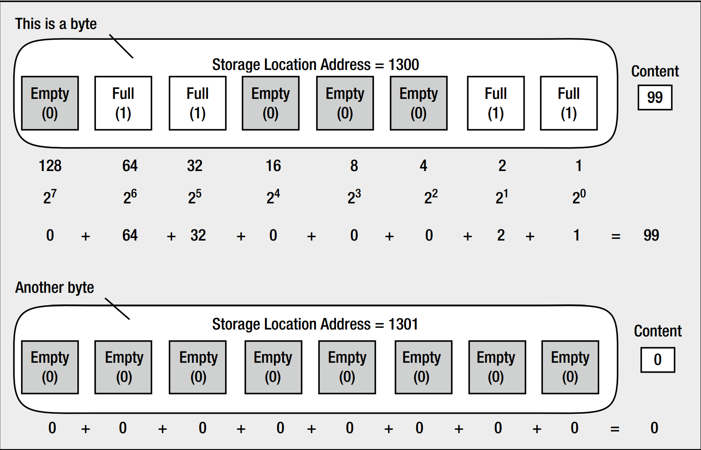

# Chapter-02_First_Steps_in_Programming

## Memory in Your Computer

The instructions that make up your program, and the data that it acts upon, have to be stored somewhere that's instantly accessible while your computer is executing that program. When your program is running, the program instructions and data are stored in the main memory or the random access memory (RAM) of the machine. RAM is volatile storage. When you switch off your PC, the contents of RAM are lost. Your PC has permanent storage in the
form of one or more disk drives. Anything you want to keep when a program finishes executing needs to be printed or written to disk, because when the program ends, the results stored in RAM will be lost.

You can think of RAM as an ordered sequence of boxes. Each of these boxes is in one of two states: either the box is full when it represents 1 or the box is empty when it represents 0. Therefore, each box represents one binary digit, either 0 or 1. The computer sometimes thinks of these in terms of true and false: 1 is true and 0 is false. Each of these boxes is called a bit, which is a contraction of binary digit.

For convenience, the bits in memory are grouped into sets of eight, and each set of eight bits is called a *byte*. To allow you to refer to the contents of a particular byte, each byte has been labeled with a number, starting from 0 for the first byte, 1 for the second byte, and so on, up to whatever number of bytes you have in your computer's memory. This label for a byte is called its *address*. Thus, the address of each byte is unique. Just as a street address identifies a particular house, the address of a byte uniquely references that byte in your computer's memory.

To summarize, memory consists of a large number of bits that are in groups of eight (called bytes) and each byte has a unique address. Byte addresses start from 0. A bit can only be either 1 or 0.



The amount of memory your computer has is expressed in terms of so many kilobytes, megabytes, or gigabytes, and in the case of large disk drives, terabytes. Here's what those words mean:

* 1 kilobyte (or 1KB) is 1,024 bytes.
* 1 megabyte (or 1MB) is 1,024 kilobytes, which is 1,048,576 bytes.
* 1 gigabyte (or 1GB) is 1,024 megabytes, which is 1,073,741,824 bytes.
* 1 terabyte (or 1TB) is 1,024 gigabytes, which is 1,099,511,627,776 bytes.

If you have a gigabyte of RAM in your PC, byte addresses will be from 0 to 1,073,741,823 inclusive. For a megabyte, you need 20 bits, and for a gigabyte, you need 30 bits.

Confusion can arise with disk drive capacities. Disk drive manufacturers often refer to a disk as having a capacity of 256 gigabytes or 1 terabyte, when they really mean 256 billion bytes and 1 trillion bytes. Of course, 256 billion bytes is only 231 gigabytes and 1 trillion bytes is only 911 gigabytes, so a manufacturer’s specification of the capacity of a hard disk looks more impressive than it really is.

## What Is a Variable?

A variable in a program is a specific piece of memory that consists of one or more contiguous bytes, typically 1, 2, 4, 8 or 16 bytes. Every variable in a program has a name, which will correspond to the memory address for the variable. You use the variable name to store a data value in memory or retrieve the data that the memory contains.

You can have as many variables as you like in a program. The value that each variable contains, at any point during the execution of that program, is determined by the instructions contained in your program. The value of a variable isn’t fixed, and you can change it whenever you need to throughout a program.

### Naming Variables

The name you give to a variable, conveniently referred to as a variable name, can be defined with some flexibility. A variable name is a sequence of one or more uppercase or lowercase letters, digits, and underscore characters (_) that begin with a letter (incidentally, the underscore character counts as a letter). Examples of legal variable names
are as follows:

```c
Radius diameter Auntie_May Knotted_Wool D678
```

A variable name must not begin with a digit, so 8_Ball and 6_pack aren't legal names. A variable name must not include characters other than letters, underscores, and digits, so Hash! and Mary-Lou aren't allowed as names. This last example is a common mistake, but Mary_Lou would be quite acceptable. Because spaces aren't allowed in a name, Mary Lou would be interpreted as two variable names, Mary and Lou. Variables starting with one or two underscore characters are often used in the header files, so don't use the underscore as the first character in your variable names; otherwise, you run the risk of your name clashing with the name of a variable used in the standard library. For example, names such as _this and _that are best avoided. Another very important point to remember about variable names is that they are case sensitive. Thus, the names Democrat and democrat are distinct.

Although you can call variables whatever you want within the preceding constraints, it's worth calling them something that gives you a clue as to what they contain. Assigning the name x to a variable that stores a salary isn't very helpful. It would be far better to call it salary and leave no doubt as to what it is.

**Caution:** The maximum number of characters that you can have in a variable name will depend on your compiler. A minimum of 31 characters must be supported by a compiler that conforms to the C standard, so you can always use names up to this length without any problems. BUT very long names become tedious to type and make the code hard to follow. Some compilers will truncate names that are too long.

### Variables That Store Integers

There are several different types of variables, and each type of variable is used for storing a particular kind of data. There are several types that store integers, types that store nonintegral numerical values, and types that store characters. Where there are several types to store a particular kind of data, such as integers, the difference between the types is in the amount of memory they occupy and the range of values they can hold.

An integer is any whole number without a decimal point.

Integers are always written in C without a decimal point; if there's a decimal point, it isn't an integer—it's a floating-point value.

```c
int salary; 		// Declare a variable called salary
```

This statement is called a *variable declaration* because it declares the name of the variable. The name, in this case, is salary.

**Caution** Notice that the variable declaration ends with a semicolon. If you omit the semicolon, your program will generate an error when you try to compile it.

The variable declaration also specifies the type of data that the variable will store. You've used the keyword *int* to specify that the variable, salary, will be used to store an integer value of type int. The keyword *int* precedes the name of the variable. This is just one of several different types you can use to store integers.

The declaration for the variable, salary, is also a definition because it causes some memory to be allocated to hold an integer value, which you can access using the name salary.

You have not specified what the value of salary should be yet, so at this point it will contain a **junk value**—whatever was left behind from when this bit of memory was used last.

```c
salary = 10000; // Store 10000 in salary
```

This is a simple arithmetic assignment statement. It takes the value to the right of the equal sign and stores it in the variable on the left of the equal sign.

```c
printf("My salary is %d.\n", salary);
```

There are now two arguments inside the parentheses, separated by a comma. An argument is a value that's passed to a function. In this program statement, the two arguments to the printf() function are:

* The first argument is a *control string*, so called because it controls how the output specified by the following argument or arguments is to be presented. This is the character string between the double quotes. It is also referred to as a *format string* because it specifies the format of the data that are output.
* The second argument is the name of the variable, salary. The control string in the first argument determines how the value of salary will be displayed.

% is called a conversion specifier for the value of the variable. Conversion specifiers determine how variable values are displayed on the screen. In other words, they specify the form to which an original binary value is to be converted before it is displayed. In this case, you've used a **d, which is a decimal specifier** that applies to integer values. It just means that the second argument, salary, will be represented and output as a decimal (base 10) number.

(Conversion specifiers always start with a % character so that the printf() function can recognize them. Because a % in a control string always indicates the start of a conversion specifier, you must use the escape sequence %% when you want to output a % character.)
