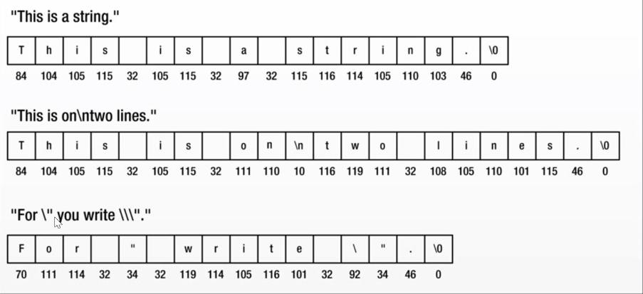
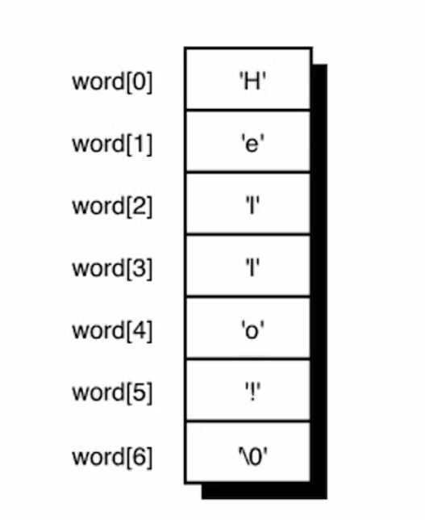
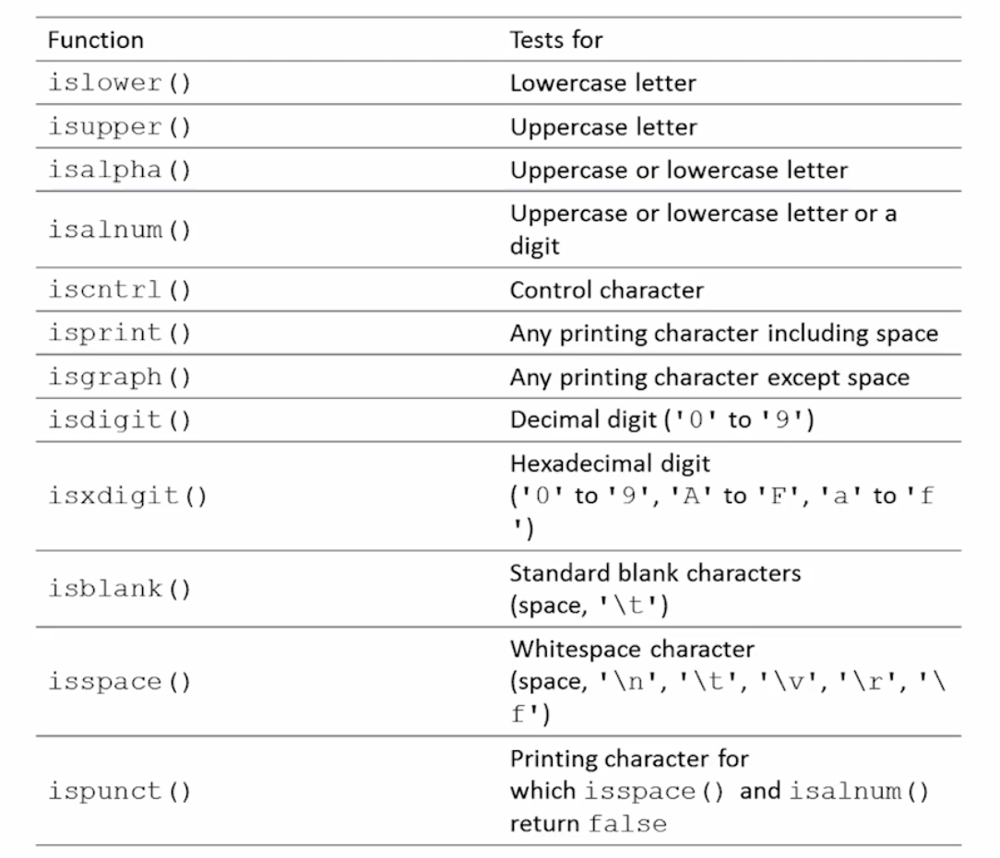
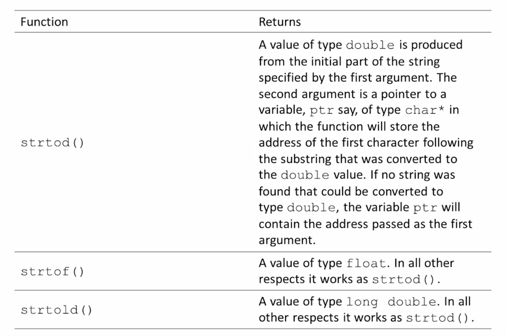

# 08-Character_Strings

## Overview

### Strings

We have learned all about the char data type which contains a single character. To assign a single character to a char variable, the character is enclosed within a pair of single quotation marks:

```c
plusSign = '+';
```

You have also learned that there is a distinction made between the single quotation and double quotation marks.

```c
plusSign = "+"; // incorrect if plusSign is a char
```

A string constant or string literal is a sequence of characters or symbols between a pair of double-quote characters. Anything between a pair of double quotes is interpreted by the compiler as a string, includes any special characters and embedded spaces.

Every time you have displayed a message using the printf() function, you have defined the message as a string constant.

```c
printf("This is a string.");

printf("This is on\ntwo lines!");

printf("For \" you write \\\".");
```

Understand the difference between single quotation and double quotation marks. Both are used to create two different types of constants in C.

For the third example above, you must specify a double quote within a string as the escape sequence \\\", because the compiler will interpret an explicit double quote without a preceding backslash as a string delimiter. Also, you must also use the escape sequence \\\ when you want to include a backslash in a string. A backslash in a string always signals the start of an escape sequence to the compiler.

### String in Memory



### Null Character

A special character with the code value 0 is added to the end of each string to mark where it ends. This character is known as the null character and you write it as \0.

A string is always terminated by a null character, so the length of a string is always one greater than the number of characters in the string.

Do not confuse the null character with NULL:

* Null character is a string terminator
* NULL is a symbol that represents a memory address that doesn't reference anything

You can add a \0 character to the end of a string explicitly. This will create two strings.

```c
#include <stdio.h>

int main(void)
{
	printf("The character \0 is used to terminate a string.");
	return 0;
}
```

If you compile and run this program, you'll get this output:

The character

Only the first part of the string has been displayed. Output ends after the first two words because the function stops outputting the string when it reaches the first null character. The second \0 at the end of the string will never be reached.

The first \0 that's found in a character sequence always marks the end of the string.

## Creating a String

C has no special variable type for strings, this means there are no special operators in the language for processing strings. The standard library provides an extensive range of functions to handle strings.

Strings in C are stored in an array of type char. Characters in a string are stored in adjacent memory cells, one character per cell.

To declare a string in C, simply use the char type and the brackets to indicate the size:

```c
char myString[20];
```

This variable can accommodate a string that contains up to 19 characters -- you must allow one element for the termination character (null character).

When you specify the dimension of an array that you intend to use to store a string, it must be at least one greater than the number of characters in the string that you want to store. The compiler automatically adds \0 to the end of every string constant.

#### Initializing a String

You can initialize a string variable when you declare it.

```c
char word[] = {'H', 'e', 'l', 'l', 'o', '!'};
```

To initialize a string, it is the same as any other array initialization. In the absence of a particular array size, the C compiler automatically computes the number of elements in the array based upon the number of initializers.

This statement reserves space in memory for exactly seven characters. The null terminator is automatically added.



You can specify the size of the string explicitly, just make sure you leave enough space for the terminating null character.

```c
char word[7] = { "Hello!" };
```

If the size specified is too small, then the compiler can't fit a terminating null character at the end of the array, and it doesn't put one there (and it doesn't complain about it either).

```c
char word[6] = { "Hello!" };
```

So....., do not specify the size, let the compiler figure out, you can be sure it will be correct.

You can initialize just part of an array of elements of type char with a string.

```c
char str[40] = "To be";
```

The compiler will initialize the first five elements, str[0] to str[4], with the characters of the string constant. str[5] will contain the null character, '\0'.  Space is allocated for all 40 elements of the array.

### Assigning a value to a string after initializing

Since you can not assign arrays in C, you can not assign strings either.

The following is an error:

```c
char s[100]; // declare

s = "hello"; // initalize - DOESN'T WORK ('Ivalue required' error)
```

You are performing an assignment operation, and you cannot assign one array of characters to another array of characters like this. You have to use strncpy() to assign a value to a char array after it has been declared or initialized.

The below is perfectly valid:

```c
s[0] = 'h';
s[1] = 'e';
s[2] = 'l';
s[3] = 'l';
s[4] = 'o';
s[5] = '\0';
```

### Displaying a string

When you want to refer to a string stored in an array, you just use the array name by itself.

To display a string as output using the printf function, you do the following

```c
print("'\nThe message is: %s", message);
```

The %s format specifier is for outputting a null-terminated string. The printf() function assumes when it encounters the %s format characters that the corresponding argument is a character string that is terminated by a null character.

### Inputting a string

To input a string via the keyboard, use the scan function:

```c
char input[10];
printf("Please input your name: ");
scanf("%s", input);
```

The %s format specifier is for inputting string. No need to use the & (address of operator) on a string.

### Testing if two strings are equal

You cannot directly test two strings to see if they are equal with a statement such as

```c
if ( string1 == string2 ) //error!!!
```

The equality operator can only be applied to simple variable types, such as floats, ints, or chars and it does not work on structures or arrays.

To determine if two strings are equal, you must explicitly compare the two character strings character by character. we will discuss as easier way with the stremp function.

Reminder:

* the string constant "x" is not the same as the character constant 'x'
* 'x' is a basic type (char)
* "x" is a derived type, an array of char
* "x" really consists of two characters, 'x' and '10', the null character

Example

```c
#include <stdio h>

int main(void)
{
	char str1[] = "To be or not to be";
	char str2[] = " that is the question";
	unsigned int count = 0;     // Stores the string length

	while (str1[count] != '\0') // Increment count till we reach the
		++count;            // terminating character.

	printf("The length of the string \"%s\" is %d characters.\n", str1, count);

	count = 0;                  // Reset count for next string
	while (str2[count] != '\0') // Count characters in second string
		++count:

	printf("The length of the string \"%s\" is %d characters. \n", str2, count);
	return O;
}


```

## Constant Strings

Sometimes you need to use a constant in a program:

```c
circumference = 3.14159 * diameter;
```

The constant 3.14159 represents the world-famous constant pi (π).

There are good reasons to use a symbolic constant instead of just typing in the number -- a name tells you more than a number does.

```c
owed = 0.015 * housevalue;

owed = taxrate * housevalue; //much more meaningful
```

If you read through a long program, the meaning of the second version is plainer.

Suppose you have used a constant in several places, and it becomes necessary to change its value, you only need to alter the definition of the symbolic constant, rather than find and change every occurrence of the constant in the program.

### #define

The preprocessor lets you define constants

```c
#define TAXRATE 0.015
```

When your program is compiled, the value 0.015 will be substituted everywhere you have used TAXRATE. It's a compile-time substitution.

A defined name is not a variable. You cannot assign a value to it.

Notice that the #define statement has a special syntax: no equal sign used to assign the value 0.015 toTAXRATE, no semicolon.

#define statements can appear anywhere in a program. No such thing as a local define. Most programmers group their #define statements at the beginning of the program (or inside an include file), where they can be quickly referenced and shared by more than one source file.

The #define statement helps to make programs more portable. It might be necessary to use constant values that are related to the particular computer on which the program is running.

The #define statement can be used for character and string constants:

```c
#define BEEP '\la'
#define TEE 'T'
#define ESC '\033'
#define OOPS "Now you have done it!"
```

### const

C90 added a second way to create symbolic constants: Using the const keyword to convert a declaration for a variable into a declaration for a constant.

```c
const int MONTHS = 12; // MONTHS a symbolic constant for 12
```

const makes MONTHS into a read-only value. You can display MONTHS and use it in calculations. You cannot alter the value of MONTHS.

const is a newer approach and is more flexible than using #define: it lets you declare a type; it allows better control over which parts of a program can use the constant.

C has yet a third way to create symbolic constants -- enums.

Initializing a char array and declaring it as constant is a good way of handling standard messages.

```c
const char message[] = "The end of the world is nigh.";
```

Because you declare message as const, it's protected from being modified explicitly within the program. Any attempt to do so will result in an error message from the compiler. This technique for defining standard messages is particularly useful if they are used in many places within a program. It prevents accidental modification of such constants in other parts of the program.

## Common String Functions

You already know that a character string is a char array terminated with a null character (\0). Character strings are commonly used. C provides many functions specifically designed to work with strings. Some of the more commonly performed operations on character strings include:

* getting the length of a string

```c
strlen
```

* copying one character string to another

```c
strcpy()
strncpy()
```

* combining two character strings together (concatenation)

```c
strcat() 
strncat()
```

* determining if two character strings are equal

```c
strcmp()
strncmp()
```

The C library supplies these string-handling function prototypes in the string.h header file

### Getting the length of a string

The strlen() function finds the length of a string, returned as a size_t

```c
#include <stdio.h>
#include <string.h>

int main()
{
	char myString[] = "my string";
	printf("The length of this string is: %d", strlen(myString));

	return 0;
}
```

This function does change the string, so the function header does not use const in declaring the formal parameter string.

### Copying strings

Since you can not assign arrays in C, you can not assign strings either.

```c
char s[100]; // declare
s = "hello"; // initalize - DOESN'T WORK ('lvalue required' error)
```

You can use the strcpy() function to copy a string to an existing string. It's the string equivalent of the assignment operator.

```c
char src[50], dest[50];

strcpy(src, "This is source");
strcpy(dest, "This is destination");
```

The strepy() function does not check to see whether the source string actually fits in the target string. Safer way to copy strings is to use strncpy().

strncpy() takes a third argument, the maximum number of characters to copy.

```c
char src|40];
char dest[12];

memset(dest, '\0', sizeof(dest));
strcpy(src, "Hello how are you doing");
strncpy(dest, src, 10);
```

### String concatenation

The strcat() function takes two strings for arguments. A copy of the second string is tacked onto the end of the first. This combined version becomes the new first string. The second string is not altered.

It returns the value of its first argument, the address of the first character of the string to which the second string is appended.

```c
char myString[] = "my string";
char input [80];

printf("Enter a string to be concatenated: ");
scanf("%s", input);

printf("\n The string %s concatenated with %s is:::::\n", myString, input);
printf("%s", strcat(input, myString));
```

The strcat() function does not check to see whether the second string will fit in the first array. If you fail to allocate enough space for the first array, you will run into problems as excess characters overflow into adjacent memory locations, so use strncat() instead, which takes a second argument indicating the maximum number of characters to add.

For example, strncat(bugs, addon, 13) will add the contents of the addon string to bugs, stopping when it reaches 13 additional characters or the null character, whichever comes first.

```c
char src[50], dest[50];

strcpy(src,"This is source");
strcpy(dest, "This is destination");

strncat(dest, src, 15);

printf("Final destination string : |%s|", dest);
```

### Comparing Strings

Suppose you want to compare someone response to a stored string, you cannot use ==, it will only check to see if the string has the same address.

There is a function that compares string contents, not string addresses. It is the strcmp() (for string comparison) function. It does not compare arrays, so it can be used to compare strings stored in arrays of different sizes. It does not compare characters. You can use arguments such as "apples" and "A", but you cannot use character arguments, such as 'A'.

This function does for strings what relational operators do for numbers

* it returns 0 if its two string arguments are the same and nonzero otherwise
* if return value < 0 then it indicates str1 is less than str2
* if return value > 0 then it indicates str2 is less than str1

```c
printf("strcmp(\"A\", \"A\") is");
printf("%d\n", strcmp("A", "A"));  //0

printf("strcmp(\"A\", \"B\") is");
printf("%d\n", strcmp("A", "B"));  //-1

printf("stremp(\"B\", \"A\") is");
printf("%d\n", strcmp("B", "A"));  //1

printf("stremp(\"C\", \"A\") is");
printf("%d\n", strcmp("C", "A"));  //1

printf("strcmp(\"Z\", \"a\") is");
printf("%d\n", strcmp("Z", "a"));  //-1

printf("strcmp(\"apples\", \"apple\") is");
printf("%d\n", strcmp("apples", "apple"));  //1
```

The stremp() function compares strings until it finds corresponding characters that differ. It could take the search to the end of one of the strings.

The strncmp() function compares the strings until they differ or until it has compared a number of characters specified by a third argument. If you wanted to search for strings that begin with "astro", you could limit the search to the first five characters.

```c
if (strncmp ("astronomy", "astro", 5) == 0)
{
	printf("Found: astronomy");
}

if (strncmp ("astounding" ,"astro", 5) == 0)
{
printf("Found: astounding");
}
```

## Searching, Tokenizing and Analyzing Strings

**searching a string**

The string.h header file declares several string-searching functions for finding a single character or a substring

```c
strchr()
strstr()
```

**tokenizing a string**

A token is a sequence of characters within a string that is bounded by a delimiter (space, comma, period, etc). Breaking a sentence into words is called tokenizing

```c
strtok()
```

**analyzing strings**

```c
islower()
isupper()
isalpha()
isdigit()
```

### concept of a pointer

We are going to discuss in detail, the concept of a pointer in an upcoming section. However, in order to understand some of these string functions, I want to give you a quick peek on this concept.

C provides a remarkably useful type of variable called a pointer, a variable that stores an address. Its value is the address of another location in memory that can contain a value. We have used addresses in the past with the scanf() function.

```c
int Number = 25;
int *pNumber = &Number;
```

Above, we declared a variable, Number, with the value 25. We declared a pointer, pNumber, which contains the address of Number. Asterisk is used in declaring a pointer.

To get the value of the variable pNumber, you can use the asterisk to dereference the pointer

```c
*pNumber = 25
```

The asterisk is the dereference operator, and its effect is to access the data stored at the address specified by a pointer.


The value of &Number is the address where Number is located. This value is used to initialize Number in the second statement.

Many of the string functions return pointers. This is why I wanted to briefly mention them. Do not worry if this concept does not sink in right now, we are going to cover points in a ton of detail in an upcoming section.

### Searching a string for a character

The strchr() function searches a given string for a specified character. First argument to the function is the string to be searched (which will be the address of a char array). Second argument is the character that you are looking for.

The function will search the string starting at the beginning and return a pointer to the first position in the string where the character is found. The address of this position in memory is of type char* described as the "pointer to char."

To store the value that's returned, you must create a variable that can store the address of a character, which is pointer.

If the character is not found, the function returns a special value NULL. NULL is the equivalent of 0 for a pointer and represents a pointer that does not point to anything.

You can use the strchr() function like this

```c
char str[] = "The quick brown fox"; //The string to be searched
char ch = 'q';                      // The character we are looking for
char *pGot_char = NULL;             // Pointer initialized to NULL
pGot_char = strchr(str, ch);       // Stores address where ch is found -- "quick brown fox"
```

The first argument to strchr() is the address of the first location to be searched. Second argument is the character that is sought (ch, which is of type char). It expects its second argument to be of type int, so the compiler will convert the value of ch to this type. You could just as well define ch as type int (int ch = 'q';). pGot_char will point to the value ("quick brown fox").

### searching for a substring

The strstr() function is probably the most useful of all the searching functions. It searches one string for the first occurrence of a substring. It returns a pointer to the position in the first string where the substring is found. If no match, it returns NULL.

The first argument is the string that is to be searched. The second argument is the substring you're looking for.

```c
char text[] = "Every dog has his day";
char word[] = "dog";
char *pFound = NULL;
pFound = strstr(text, word);
```

It searches text for the first occurrence of the string stored in word. The string "dog" appears starting at the seventh character in text. Found will be set to the address text + 6 ("dog has his day"). Search is case sensitive, "Dog" will not be found.

### Tokenizing a string

A token is a sequence of characters within a string that is bound by a delimiter. A delimiter can be anything, but, should be unique to the string. Spaces, commas, and a period are good examples. Breaking a sentence into words is called tokenizing.

The strtok() function is used for tokenizing a string. It requires two arguments: string to be tokenized and a string containing all the possible delimiter characters.

```c
int main() 
{
char str[80] = "Hello how are you - my name is - jason";
const char s[2] = "-";
char *token;

/* get the first token */
token = strtok(str, s);

/* walk through other tokens */
while( token != NULL) 
	{
	printf(" %s\n", token);

	token = strtok(NULL, s);
	}

return(0);
}
```

### Analyzing strings



The argument to each of these functions is the character to be tested.

All these functions return a nonzero value of type int if the character is within the set that's being tested for. These return values convert to true and false, respectively, so you can use them as Boolean values.

```c
char buf[100];     // Input buffer
int nLetters = 0;  // Number of letters in input
int nDigits = 0;   // Number of digits in input
int nPunct = 0;    // Number of punctuation characters

printf("Enter an interesting string of less than %d characters: \n", 100);
scanf("%s", buf);  // Read a string into buffer

int i = 0;         // Buffer index
while(buff[i])
	{
	if(isalpha(buff[i]))          // Increment letter count
		++nLetters:
	else if(isdigit(buff[i]))
		++nDigits;
	else if(ispunct(buff[i]))     // Increment digit count
		++nPunct;
	++i:
	}

}
printf("\nYour string contained %d letters, %d digits and %d punctuation characters.\n", Letters, Digits, nPunct);
```

## Converting Strings

It is very common to convert character case to all upper case or all lower case. The toupper() function converts from lowercase to uppercase; The tolower() function converts from uppercase to lowercase.

Both functions return either the converted character or the same character for characters that are already in the correct case or are not convertible such as punctuation characters.

This is how you convert a string to uppercase

```c
for(int i = 0 ; (buf[i] = (char)toupper(buf[i])) != '\0' ; ++i);
```

This loop will convert the entire string in the buf array to uppercase by stepping through the string one character at a ti. Loop stops when it reaches the string termination character '\0'. The cast to type char is there because toupper() returns type int.

You can use the function topper() in combination with the strstr() function to find out whether one string occurs in another, ignoring case.

```c
char text[100];                // Input buffer for string to be searched
char substring[40];            // Input buffer for string sought

printf("Enter the string to be searched (less than %d characters):\n", 100);
scanf("%s", text);

printf("\nEnter the string sought (less than %d characters):\n", 40);
scanf("%s", substring);

printf("\nFirst string entered:\n%s\n", text);
print("Second string entered: \n%s\n", substring);

// Convert both strings to uppercase.
for(i = 0 ; (text[i] = (char)toupper(text[i])) != '\0'; ++i);
for(i = 0 ; (substring[i] = (char)toupper(substring[i])) != '\0'; ++i);

printf("The second string %s found in the first.\n", ((strstr(text, substring) == NULL) ? "was not" : "was"));
```

the stdlib.h header file declares functions that you can use to convert a string to a numerical value


For all four functions, leading whitespace is ignored.

```c
char value_str[] = "98.4";
double value = atof(value_str);
```



```c
double value = 0;
char str[] = "3.5 2.5 1.26";    // The string to be converted
char *pstr = str;               // Pointer to the string to be converted
char *ptr = NULL;               // Pointer to character position after conversion

while (true)
{
	value = strtod(pstr, &ptr);   // Convert starting at pstr
	if(pstr == ptr)               // pstr stored if no conversion.
		break;                //..so we are done

	else
	{
		printf(" %f", value);    // Output the resultant value
		pstr = ptr;              // Store start for next conversion
	}
}
```
