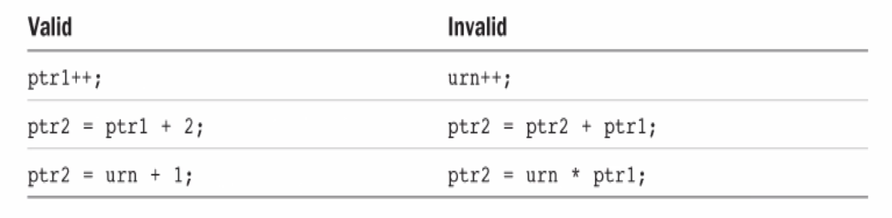

# 10-Pointers

## Overview

### Indirection

Pointers are very similar to the concept of indirection that you employ in your everyday life.

Suppose you need to buy a new ink cartridge for your printer. All purchases are handled by the purchasing department. You call Joe in purchasing and ask him to order the new cartridge for you. Joe then calls the local supply store to order the cartridge. You are not ordering the cartridge directly from the supply store yourself (indirection).

In programming languages, indirection is the ability to reference something using a name, reference, or container, instead of the value itself. The most common form of indirection is the act of manipulating a value through its memory address.

A pointer provides an indirect means of accessing the value of a particular data item. It is a variable whose value is a memory address. Its value is the address of another location in memory that can contain a value.

Just as there are reasons why it makes sense to go through the purchasing department to order new cartridges (you don't have to know which particular store the cartridges are being ordered from). There are good reasons why it makes sense to use pointers in C.

Using pointers in your program is one of the most powerful tools available in the C language. Pointers are also one of the most confusing concepts of the C language. It is important you get this concept figured out in the beginning and maintain a clear idea of what is happening as you dig deeper.

The compiler must know the type of data stored in the variable to which it points.

You need to know how much memory is occupied or how to handle the contents of the memory to which it points. Every pointer will be associated with a specific variable type. It can be used only to point to variables of that type. Pointers of type "pointer to int" can point only to variables of type int; Pointers of type "pointer to float" can point only to variables of type float.


The value of &number is the address where number is located. This value is used to initialize pnumber in the second statement.

### Why use pointers?

Accessing data by means of only variables is very limiting. With pointers, you can access any location (you can treat any position of memory as a variable for example) and perform arithmetic with pointers.

Pointers in C make it easier to use arrays and strings.

Pointers allow you to refer to the same space in memory from multiple locations, which means that you can update memory in one location and the change can be seen from another location in your program. It can also save space by being able to share components in your data structures.

Pointers allow functions to modify data passed to them as variables. This is pass by reference - passing arguments to function in way they can be changed by function.

It can also be used to optimize a program to run faster or use less memory than it would otherwise.

Pointers allow us to get multiple values from the function. A function can return only one value but by passing arguments as pointers we can get more than one values from the pointer.

With pointers dynamic memory can be created according to the program use. We can save memory from static (compile time) declarations.

Pointers allow us to design and develop complex data structures like a stack, queue, or linked list.

Pointers provide direct memory access.

## Defining Pointers

### Declaring pointers

Pointers are not declared like normal variables

```c
pointer ptr; // not the way to declare a pointer/
```

It is not enough to say that a variable is a pointer. You also have to specify the kind of variable to which the pointer points. Different variable types take up different amounts of storage. Some pointer operations require knowledge of that storage size.

You declare a pointer to a variable of type int with:

```c
int *pnumber;
```

The type of the variable with the name pnumber is int*. It can store the address of any variable of type int.

```c
int * pi;             // pi is a pointer to an integer variable
char * pc;            // pc is a pointer to a character variable
float * pf, pg;       // pf, pg are pointers to float variables
```

The space between the * and the pointer name is optional. Programmers use the space in a declaration and omit it when dereferencing a variable.

The value of a pointer is an address, and it is represented internally as an unsigned integer on most systems. However, you shouldn't think of a pointer as an integer type. Things you can do with integers that you can not do with pointers, and vice versa. You can multiply one integer by another, but you can not multiply one pointer by another.

A pointer really is a new type, not an integer type. %p represents the format specifier for pointers.

The previous declarations creates the variable but does not initialize it. It's dangerous when pointers are not initialized. You should always initialize a pointer when you declare it.

### NULL Pointers

You can initialize a pointer so that it does not point to anything:

```c
int *number = NULL;
```

NULL is a constant that is defined in the standard library. It is the equivalent of zero for a pointer.

NULL is a value that is guaranteed not to point to any location in memory. What it means is that it implicitly prevents the accidental overwriting of memory by using a pointer that does not point to anything specific.

We need to add an #include directive for stddef.h to your source file, if we want to use the NULL..

### Address of operator

If you want to initialize your variable with the address of a variable you have already declared, use the address of operator, &.

```c
int number = 99;

int *pnumber = &number;
```

The initial value of number is the address of the variable number. The declaration of number must precede the declaration of the pointer that stores its address. Compiler must have already allocated space and thus an address for number to use it to initialize pnumber.

### Be careful

There is nothing special about the declaration of a pointer. You can declare regular variables and pointers in the same statement.

```c
double value, *pVal, fnum;  // only the second variable, pVal, is a pointer

int *p, q;      // declares a pointer, p of type int*, and a variable, q, that is of type int
```

It's a common mistake to think that both p and q are pointers.

Also, it is a good idea to use names beginning with p as pointer names.

## Accessing Pointers

### Accessing pointer values

You use the indirection operator, *, to access the value of the variable pointed to by a pointer. It also referred to as the dereference operator because you use it to "dereference" a pointer.

```c
int number = 15;
int *pointer = &number;
int result = 0;
```

The pointer variable contains the address of the variable number. You can use this in an expression to calculate a new value for result.

```c
result = *pointer + 5;
```

The expression *pointer will evaluate to the value stored at the address contained in the pointer. The value stored in number, 15, so result will be set to 15 + 5, which is 20.

The indirection operator, *, is also the symbol for multiplication, and it is used to specify pointer types. It depends on where the asterisk appears, the compiler will understand whether it should interpret it as an indirection operator, as a multiplication sign, or as part of a type specification. The context determines what it means in any instance.

```c
int main (void)
{
	int count = 10, X;
	int *int_pointer;

	int_pointer = &count;
	x= *int_pointer;

	printf ("count = %i, x = %i\n", count, x);

	return 0;
}
```

### Displaying a pointers value

To output the address of a variable, you use the output format specifier %p. It outputs a pointer value as a memory address in hexadecimal form.

```c
int number = 0;       // A variable of type int initialized to 0
int *pnumber = NULL;  // A pointer that can point to type int

number = 10;
pnumber = &number;
printf("pnumber's value: %p\n", pnumber);  // Output the value (an address)
```

Pointers occupy 8 bytes and the addresses have 16 hexadecimal digits. if a machine has a 64-bit operating system and my compiler supports 64-bit addresses. Some compilers only support 32-bit addressing, in which case addresses will be 32-bit addresses.

```c
printf("number's address: %p\n", &number);              // Output the address
printf("pnumber's address: %p\n", (void*)&pnumber);     // Output the address
```

Remember, a pointer itself has an address, just like any other variable. You use %p as the conversion specifier to display an address. You use the & (address of) operator to reference the address that the number variable occupies.

The cast to void* is to prevent a possible warning from the compiler. The %p specification expects the value to be some kind of pointer type, but the type of &pnumber is "pointer to pointer to int".

### Displaying the number of bytes a pointer is using

You use the sizeof operator to obtain the number of bytes a pointer occupies. On my machine this shows that a pointer occupies 8 bytes. A memory address on my machine is 64 bits.

You may get a compiler warning when using sizeof this way. size_t is an implementation-defined integer type. To prevent the warning, you could cast the argument to type int like this:

```c
printf("pnumber's size: %d bytes\n", (int)sizeof(pnumber));  // Output the size
```

```c
it main(void)
{
	int number = 0;        // A variable of type int initialized to 0
	int *pnumber = NULL;    // A pointer that can point to type int

	number = 10;
	printf("number's address: %p\n", &number);   // Output the address
	printf("number's value: %d\n\n", number);    // Output the value

	pnumber = &number;   // Store the address of number in pnumber

	printf("pnumber's address: %p\n", (void*)&pnumber);        // Output the address
	printf("pnumber's size: %zd bytes\n", sizeof(pnumber));    // Output the size
	printf("pnumber's value: %p\n", pnumber);	// Output the value (an address)
	printf("value pointed to: %d\n", *pnumber);	// Value at the address

	return O;
}
```

## Using Pointers

C offers several basic operations you can perform on pointers.

You can assign an address to a pointer. Assigned value can be an array name, a variable preceded by address operator (&), or another second pointer.

You can dereference a pointer. The * operator gives the value stored in the pointed-to location.

You can take a pointer address. The & operator tells you where the pointer itself is stored.

You can perform pointer arithmetic. Use the + operator to add an integer to a pointer or a pointer to an integer (integer is multiplied by the number of bytes in the pointed-to type and added to the original address). Increment a pointer by one (useful in arrays when moving to the next element). Use the - operator to subtract an integer from a pointer (integer is multiplied by the number of bytes in the pointed-to type and subtracted from the original address). Decrementing a pointer by one (useful in arrays when going back to the previous element).

You can find the difference between two pointers. You do this for two pointers to elements that are in the same array to find out how far apart the elements are.

You can use the relational operators to compare the values of two pointers. Pointers must be the same type.

Remember, there are two forms of subtraction. You can subtract one pointer from another to get an integer; You can subtract an integer from a pointer and get a pointer.

Be careful when incrementing or decrementing pointers and causing an array "out of bounds" error. Computer does not keep track of whether a pointer still points to an array element.

### Pointers used in expressions

The value referenced by a pointer can be used in an arithmetic expressions. If a variable is defined to be of type "pointer to integer" then it is evaluated using the rules of integer arithmetic.

```c
int number = 0;          // A variable of type int initialized to 0
int *pnumber = NULL;     // A pointer that can point to type int

number = 10;
pnumber = &number;       // Store the address of number in pnumber

*pnumber += 25;
```

Increments the value of the number variable by 25. The * indicates you are accessing the contents to which the variable called pnumber is pointing to.

If a pointer points to a variable x, that pointer has been defined to be a pointer to the same data type as is x. The use of *pointer in an expression is identical to the use of x in the same expression.

A variable defined as a "pointer to int" can store the address of any variable of type int.

```c
int value = 999;
pnumber = &value;
*pnumber += 25;
```

The statement will operate with the new variable, value. The new contents of value will be 1024.

A pointer can contain the address of any variable of the appropriate type. You can use one pointer variable to change the values of many different variables, as long as they are of a type compatible with the pointer type.

```c
int main(void)
{
	long num1 = 0L;
	long num2 = 0L;
	long *pnum = NULL;

	pnum = &num1;          // Get address of num1
	*pnum = 2L;            // Set num1 to 2
	++num2;                // Increment num2
	num2 += *pnum;         // Add num1 to num2

	pnum = &num2;          // Get address of num2
	++*pnum;               // Increment num2 indirectly

	printf("num1 = %ld num2 = %ld *pnum = %ld *pnum + num2 = %ld\n", num1, num2, *pnum, *pnum + num2);

	return 0;
}
```

### When receiving Input

When we have used scanf() to input values, we have used the & operator to obtain the address of a variable on the variable that is to store the input (second argument).

When you have a pointer that already contains an address, you can use the pointer name as an argument for scanf().

```c
int value = 0;
int *pvalue = &value;                   // Set pointer to refer to value

printf ("Input an integer:");
scanf(" %d", pvalue);                   // Read into value via the pointer

printf("You entered %d. \n", value);    // Output the value entered
```

### Testing for NULL

There is one rule you should burn into your memory: **DO NOT dereference an uninitialized pointer.**

```c
int * pt; // an uninitialized pointer
*pt = 5; // a terrible error
```

Second line means store the value 5 in the location to which pt points. pt has a random value, there is no knowing where the 5 will be placed.

It might go somewhere harmless, it might overwrite data or code, or it might cause the program to crash.

Creating a pointer only allocates memory to store the pointer itself. It does not allocate memory to store data. Before you use a pointer, it should be assigned a memory location that has already been allocated, so that you can assign the address of an existing variable to the pointer. Or you can use the malloc() function to allocate memory first.

We already know that when declaring a pointer that does not point to anything, we should initialize it to NULL.

```c
int *pvalue = NULL;
```

NULL is a special symbol in C that represents the pointer equivalent to 0 with ordinary numbers. The below also sets a pointer to null using 0:

```c
int *pvalue = 0;
```

Because NULL is the equivalent of zero, if you want to test whether pvalue is NULL, you can do this, or you can do it explicitly by using == NULL

```c
if(!pvalue)......
```

You want to check for NULL before you dereference a pointer often when pointers are passed to functions.

## Pointers and const

When we use the const modifier on a variable or an array it tells the compiler that the contents of the variable/array will not be changed by the program. With pointers, we have to consider two things when using the const modifier:

* whether the pointer will be changed
* whether the value that the pointer points to will be changed

You can use the const keyword when you declare a pointer to indicate that the value pointed to must not be changed.

```c
long value = 9999L;
const long *pvalue = &value;       // defines a pointer to a constant
```

**You have declared the value pointed to by pvalue to be const.** The compiler will check for any statements that attempt to modify the value pointed to by pvalue and flag such statements as an error.

The following statement will now result in an error message from the compiler

```c
*pvalue = 8888L;   // Error - attempt to change const location
```

### pointers to constants

You can still modify value (you have only applied const to the pointer)

```c
value = 7777L;
```

The value pointed to has changed, but you did not use the pointer to make the change. The pointer itself is not constant, so you can still change what it points to:

```c
long number = 8888L;
pvalue = &number;        // OK - changing the address in pvalue
```

We will change the address stored in pvalue to point to number and still cannot use the pointer to change the value that is stored. You can change the address stored in the pointer as much as you like. Using the pointer to change the value pointed to is not allowed, even after you have changed the address stored in the pointer.

### constant pointers

You might also want to ensure that the address stored in a pointer cannot be changed. You can do this by using the const keyword in the declaration of the pointer:

```c
int count = 43;
int *const pcount = &count;       // Defines a constant pointer
```

**The above ensures that a pointer always points to the same thing.** It indicates that the address stored must not be changed. The compiler will check that you do not inadvertently attempt to change what the pointer points to elsewhere in your code.

```c
int item = 34;
pcount = &item;      // Error - attempt to change a constant pointer
```

It is all about where you place the const keyword, either before the type or after the type:

```c
const int * ......        // value can not be changed

int *const ......         // pointer address cannot change
```

You can still change the value that pcount points to using pcount:

```c
*pcount = 345;     // OK - changes the value of count
```

It references the value stored in count through the pointer and changes its value to 345.

You can create a constant pointer that points to a value that is also constant:

```c
int item = 25;
const int *const pitem = &item;
```

The pitem is a constant pointer to a constant so everything is fixed. You cannot change the address stored in pitem; You cannot use pitem to modify what it points to. However, you can still change the value of item directly. If you wanted to make everything not change, you could specify item as const as well.

## void pointers

The type name void means absence of any type

A pointer of type void* can contain the address of a data item of any type. void* is often used as a parameter type or return value type with functions that deal with data in a type-independent way. So you can allow your function to be more flexible if it takes void star pointers. It basically means that your function can take more than one type of variable except it's not completely flexible because you have to cast it some way when you dereference it.

Any kind of pointer can be passed around as a value of type void* . The void pointer does not know what type of object it is pointing to, so, it cannot be dereferenced directly. The void pointer must first be explicitly cast to another pointer type before it is dereferenced.

The address of a variable of type int can be stored in a pointer variable of type void*. When you want to access the integer value at the address stored in the void* pointer, you must first cast the pointer to type int*

```c
int i = 10;
float f = 2.34;
char ch = 'k';

void *vptr;

votr = &i;
printf("Value of i = %d\n", *(int *)vptr);

vptr = &f;
printf("Value of f = %.2f\ n", *(float *)vptr);

vptr = &ch;
printf("Value of ch = %c\n", *(char *)vptr);
```

## Pointers and Arrays

An array is a collection of objects of the same type that you can refer to using a single name.

A pointer is a variable that has as its value a memory address that can reference another variable or constant of a given type. You can use a pointer to hold the address of different variables at different times (must be same type).

Arrays and pointers seem quite different, but, they are very closely related and can sometimes be used interchangeably. One of the most common uses of pointers in C is as pointers to arrays. The main reasons for using pointers to arrays are ones of notational convenience and of program efficiency. Pointers to arrays generally result in code that uses less memory and executes faster.

Arrays and Pointers

If you have an array of 100 integers

```c
int values[100];
```

You can define a pointer called valuesPtr, which can be used to access the integers contained in this array

```c
int *valuesPtr;
```

When you define a pointer that is used to point to the elements of an array, you do not designate the pointer as type "pointer to array". You designate the pointer as pointing to the type of element that is contained in the array.

To set valuesPtr to point to the first element in the values array, you write

```c
valuesPtr = values;
```

The address operator is not used. The C compiler treats the appearance of an array name without a subscript as a pointer to the array. Specifying values without a subscript has the effect of producing a pointer to the first element of values.

An equivalent way of producing a pointer to the start of values is to apply the address operator to the first element of the array:

```c
valuesPtr = &values[0];
```

The two expressions ar[i] and *(ar+i) are equivalent in meaning. Both work if ar is the name of an array, and both work if ar is a pointer variable. Using an expression such as ar++ only works if ar is a pointer variable.

## Pointer Arithmetic

The real power of using pointers to arrays comes into play when you want to sequence through the elements of an array.

```
*valuesPtr // can be used to access the first integer of the values array, that is, values[0]
```

To reference values[3] through the valuesPtr variable, you can add 3 to valuesPtr and then apply the indirection operator

```c
*(valuesPtr + 3)
```

The expression, *(valuesPtr + i) can be used to access the value contained in values[i]. To set values[10] to 27, you could do the following:

```c
values[10] = 27;
```

or, using valuesPtr, you could

```c
*(valuesPtr + 10) = 27;
```

To set valuesPtr to point to the second element of the values array, you can apply the address operator to values[1] and assign the result to valuesPtr:

```c
valuesPtr = &values[1];
```

If valuesPtr points to values[0], you can set it to point to values[1] by simply adding 1 to the value of valuesPtr:

```c
valuesPtr += 1;
```

This is a perfectly valid expression in C and can be used for pointers to any data type.

The increment and decrement operators ++ and -- are particularly useful when dealing with pointers. Using the increment operator on a pointer has the same effect as adding one to the pointer; using the decrement operator has the same effect as subtracting one from the pointer.

```c
++valuesPtr;
```

It sets valuesPtr pointing to the next integer in the values array (values[1])

```
--textPtr;
```

It sets valuesPtr pointing to the previous integer in the values array, assuming that valuesPtr was not pointing to the beginning of the values array

```c
int arraySum (int array[], const int n)
{
	int sum = 0, *ptr;
	int * const arrayEnd = array + n;

	for (ptr = array; ptr < arrayEnd; ++ptr )
		sum += *ptr;

	return sum;
}

void main (void)
{
	int arraySum (int array[], const int n);
	int values[10] = {3, 7, -9, 3, 6, -1, 7, 9, 1, -5 };

	printf ("The sum is %i\n", arraySum (values, 10));
}
```

To pass an array to a function, you simply specify the name of the array. To produce a pointer to an array, you need only specify the name of the array.

This implies that in the call to the arraySum() function, what was passed to the function was actually a pointer to the array values. And this explains why you are able to change the elements of an array from within a function.

So, you might wonder why the formal parameter inside the function is not declared to be a pointer.

```c
int arraySum (int *array, const int n)
```

The above is perfectly valid. Pointers and arrays are intimately related in C. This is why you can declare array to be of type "array of ints" inside the arraySum function or to be of type "pointer to int."

If you are going to be using index numbers to reference the elements of an array that is passed to a function, declare the corresponding formal parameter to be an array, which more correctly reflects the use of the array by the function

If you are using the argument as a pointer to the array, declare it to be of type pointer.

```c
int arraySum (int *array, const int n)
{
	int sum = 0;
	int * const arrayEnd = array + n;

	for ( ; array < arrayEnd; ++array)
		sum += *array;

	return sum;
}

void main (void)
{
	int arraySum (int *array, const int n);
	int values[10] = {3, 7, -9, 3, 6, -1, 7, 9, 1, -5 };

	printf ("The sum is %i\n", arraySum (values, 10));
}
```

### Summary

```c
int urn[3];
int * ptr1, * ptr2;
```



Functions that process arrays actually use pointers as arguments.

You have a choice between array notation and pointer notation for writing array processing functions. Using array notation makes it more obvious that the function is working with arrays. Array notation has a more familiar look to programmers versed in FORTRAN, Pascal, Modula-2, or BASIC. Other programmers might be more accustomed to working with pointers and might find the pointer notation more natural. It's closer to machine language and, with some compilers, leads to more efficient code.

### Pointers and Arrays Example

This program demonstrates the effect of adding an integer value to a pointer.

```c
#include <stdio.h>
#include <string.h>

int main(void)
{
	char multiple[] = "a string";
	char *p = multiple;

	for(int i = 0; i < strnlen(multiple, sizeof(multiple)) ; ++i)
		printf ("multiple[%d] = %c *(p+%d) = %c &multiple[%d] = %p p+%d = %p\n", 
		i, multiple[i], i, *(p+i), i, &multiple[i], i, p+i);

	return 0;
}
```

Another Example

```c
#include <stdio.h>

int main(void)
{
	long multiple[] = {15L, 25L, 35L, 45L};
	long *p = multiple:

	for(int i = 0 ; i < sizeof(multiple)/sizeof(multiple[0]) ; ++i)
		printf("address p+%d (&multiple[%d]): %llu    *(p+%d) value: %d\n",
		i, i, (unsigned long long)(p+i), i, *(p+i));

	printf("\n Type long occupies: %d bytes\n", (int)sizeof(long));

	return 0;
}
```

## Pointers  and Strings

We now know how arrays relate to pointers and the concept of pointer arithmetic. These concepts can be very useful when applied to character arrays (strings).

One of the most common applications of using a pointer to an array is as a pointer to a character string. The reasons are one of notational convenience and efficiency. Using a variable of type pointer to char to reference a string gives you a lot of flexibility.

Lets look at an example that uses an array to copy a string:

```c
// array parameter
void copyString (char to[], char from[l)
{
	int i;

	for (i =0; from[i] != '\0'; ++i)
		to[i] = from[i];

	to[i] = '\0';
}

// char * parameter
void copyString (char *to, char *from)
{
	for( ; *from != '\0'; ++from, ++to)
		*to = *from;
	*to = '\n';
}
```

### char arrays as pointers

If you have an array of characters called text, you could similarly define a pointer to be used to point to elements in text

```c
char *textPtr;
```

If textPtr is set pointing to the beginning of an array of chars called text

```c
++textPtr;
```

The above sets textPtr pointing to the next character in text, which is text[1]

```c
--textPtr;
```

The above sets textPtr pointing to the previous character in text, assuming that textPtr was not pointing to the beginning of text prior to the execution of this statement

### Example optimized

```c
void copyString (char *to, char *from)
{
	while (*from ) // the null character is equal to the value O, so will jump out then
		*to++ = *from++;

	*to = \0';
}

int main (void)
{
	char string1[] = "A string to be copied.";
	char string2[50];

	copyString (string2, string1);
	printf ("%s\n", string2);
}
```

## Pass by Reference

There are a few different ways you can pass data to a function:

* pass by value
* pass by reference

Pass by value is when a function copies the actual value of an argument into the formal parameter of the function. Changes made to the parameter inside the function have no effect on the argument.

C programming uses call by value to pass arguments. This means the code within a function cannot alter the arguments used to call the function. There are no changes in the values, though they had been changed inside the function.

```c
/* function definition to swap the values */
void swap(int x, int y) 
{
	int temp;

	temp = x;      /* save the value of x */
	x = y;         /* put y into x */
	y = temp;      /* put temp into y */

	return;
}

int main()
{
	/* local variable definition */
	int a = 100;
	int b = 200;

	printf("Before swap, value of a : %d\n", a); // 100
	printf("Before swap, value of b : %d\n", b); // 200

	/* calling a function to swap the values */
	swap(a, b);

	printf("After swap, value of a : %d\n", a); //100
	printf("After swap, value of b : %d\n", b); //200

	return 0;
}
```

### Passing data using copies of pointers

Pointers and functions get along quite well together. You can pass a pointer as an argument to a function and you can also have a function return a pointer as its result.

Pass by reference copies the address of an argument into the formal parameter. The address is used to access the actual argument used in the call. This means the changes made to the parameter affect the passed argument.

To pass a value by reference, argument pointers are passed to the functions just like any other value. You need to declare the function parameters as pointer types. Unlike call by value where the changes do not reflect outside the function, changes inside the function are reflected outside the function as well.

```c
/* function definition to swap the values */
void swap(int *x, int *y) 
{
	int temp;

	temp = *x;      /* save the value at address x */
	*x = *y;         /* put y into x */
	*y = temp;      /* put temp into y */

	return;
}

int main() 
{
	/* local variable definition */
	int a = 100;
	int b = 200;

	printf("Before swap, value of a : %d\n", a); // 100
	printf("Before swap, value of b : %d\n", b); // 200

	swap(&a, &b);

	printf("After swap, value of a : %d\n", a); // 200
	printf("After swap, value of b : %d\n", b); // 100

	return 0;
}
```

### Summary of syntax

You can communicate two kinds of information about a variable to a function

* function1(x);

You transmit the value of x and the function must be declared with the same type as x

```
int function1(int num)
```

* function2(&x);

You transmit the address of x and requires the function definition to include a pointer to the correct type

```c
int function2(int * ptr)
```

### cost pointer parameters

You can qualify a function parameter using the const keyword. This indicates that the function will treat the argument that is passed for this parameter as a constant. It's only useful when the parameter is a pointer. Because if you're passing by value and you're not passing in pointers, it doesn't matter because it's not going to affect the change on the outside the function. **The only reason you make a pointer constant is because you don't want to have outside the function values changing.**

You apply the const keyword to a parameter that is a pointer to specify that a function will not change the value to which the argument points.

```c
bool SendMessage(const char* pmessage)
{
	// Code to send the message
	return true;
}
```

The type of the parameter, pmessage, is a pointer to a const char. It is the char value that's const, not its address. You could specify the pointer itself as const too, but this makes little sense because the address is passed by value and you cannot change the original pointer in the calling function.

The compiler knows that an argument that is a pointer to constant data will be safe.

If you pass a pointer to constant data as the argument for a parameter then the parameter must be a use the above.

### returning pointers from a function

Returning a pointer from a function is a particularly powerful capability. It provides a way for you to return not just a single value, but a whole set of values!

You would have to declare a function returning a pointer

```c
int * myFunction() {
.
.
.
}
```

Be careful though, there are specific hazards related to returning a pointer. **Use local variables to avoid interfering with the variable that the argument points to.**

## Dynamic memory  allocation

Whenever you define a variable in C, the compiler automatically allocates the correct amount of storage for you based on the data type.

It is frequently desirable to be able to dynamically allocate storage while a program is running.

If you have a program that is designed to read in a set of data from a file into an array in memory, you have three choices:

* define the array to contain the maximum number of possible elements at compile time
* use a variable-length array to dimension the size of the array at runtime
* allocate the array dynamically using one of C's memory allocation routines

With the first approach, you have to define your array to contain the maximum number of elements that would be read into the array:

```c
Int dataArray [1000];
```

The data file cannot contain more that 1000 elements, if it does, your program will not work. If it is larger that 1000 you must go back to the program, change the size to be larger and recompile it. No matter what value you select, you always have the chance of running into the same problem again in the future.

Using the dynamic memory allocation functions, you can get storage as you need it. This approach enables you to allocate memory as the program is executing.

Dynamic memory allocation allows memory for storing data to be allocated dynamically when your program executes. Allocating memory dynamically is possible only because you have pointers available.

The majority of production programs will use dynamic memory allocation.

Allocating data dynamically allows you to create pointers at runtime that are just large enough to hold the amount of data you require for the task.

### Heap vs. Stack

Dynamic memory allocation reserves space in a memory area called the heap.

The stack is another place where memory is allocated. Function arguments and local variables in a function are stored here. When the execution of a function ends, the space allocated to store arguments and local variables is freed.

The memory in the heap is different in that it is controlled by you. When you allocate memory on the heap, it is up to you to keep track of when the memory you have allocated is no longer required. You must free the space you have allocated to allow it to be reused.

## malloc, calloc and realloc

### malloc

The simplest standard library function that allocates memory at runtime is called malloc(). You need to include the stdlib.h header file. You specify the number of bytes of memory that you want allocated as the argument. The function returns the address of the first byte of memory that it allocated. Because you get an address returned, a pointer is the only place to put it.

```c
int *pNumber = (int*)malloc(100);
// malloc only returns a address, you have to cast it to an end pointer,
// because that address is storing an int pointer.
```

In the above, you have requested 100 bytes of memory and assigned the address of this memory block to pNumber. pNumber will point to the first int location at the beginning of the 100 bytes that were allocated. It can hold 25 int values on my computer, because they require 4 bytes each. This assumes that type int requires 4 bytes.

It would be better to remove the assumption that ints are 4 bytes

```c
int *pNumber = (int*)malloc(25*sizeof(int));
```

The argument to malloc() above is clearly indicating that sufficient bytes for accommodating 25 values of type int should be made available.

Also notice the cast (int*), which converts the address returned by the function to the type pointer to int, malloc returns a pointer of type pointer to void, so you have to cast.

You can request any number of bytes.

If the memory that you requested can not be allocated for any reason, malloc() returns a pointer with the value NULL. It is always a good idea to check any dynamic memory request immediately using an if statement to make sure the memory is actually there before you try to use it.

```c
int *pNumber = (int*)malloc(25*sizeof(int));
if(!pNumber)
{
	// code to deal with memory allocation failure
}
```

You can at least display a message and terminate the program. It's much better than allowing the program to continue and crash when it uses a NULL address to store somethir

### releasing memory

When you allocate memory dynamically, you should always release the memory when it is no longer required.

Memory that you allocate on the heap will be automatically released when your program ends. It's better to explicitly release the memory when you are done with it, even if it's just before you exit from the program.

A memory leak occurs when you allocate some memory dynamically and you do not retain the reference to it, so you are unable to release the memory. It often occurs within a loop. Because you do not release the memory when it is no longer required, your program consumes more and more of the available memory on each loop iteration and eventually may occupy it all.

To free memory that you have allocated dynamically, you must still have access to the address that references the block of memory.

To release the memory for a block of dynamically allocated memory whose address you have stored in a pointer:

```c
free(pNumber);
pNumber = NULL;
```

The free() function has a formal parameter of type void*, so you can pass a pointer of any type as the argument.

As long as pNumber contains the address that was returned when the memory was allocated, the entire block of memory will be freed for further use.

You should always set the pointer to NULL after the memory that it points to has been freed.

### calloc

The calloc() function offers a couple of advantages over malloc(). It allocates memory as a number of elements of a given size. It initializes the memory that is allocated so that all bytes are zero. The function is declared in the stdlib.h header.

calloc() function requires two argument values:

* number of data items for which space is required
* size of each data item

```c
int *pNumber = (int*) calloc(75, sizeof(int));
```

The return value will be NULL if it was not possible to allocate the memory requested. It's very similar to using malloc(), but the big plus is that you know the memory area will be initialized to 0.

### realloc

The realloc() function enables you to reuse or extend memory that you previously allocated using malloc() or calloc().

It expects two argument values:

* a pointer containing an address that was previously returned by a call to malloc(), calloc()
* the size in bytes of the new memory that you want allocated

It allocates the amount of memory you specify by the second argument. It transfers the contents of the previously allocated memory referenced by the pointer that you supply as the first argument to the newly allocated memory. It returns a void* pointer to the new memory or NULL if the operation fails for some reason.

The most important feature of this operation is that realloc() preserves the contents of the original memory area.

```c
int main() 
{
	char *str = NULL;

	/* Initial memory allocation */
	str = (char *) malloc(15 * sizeof(char));
	strcpy(str, "jason");
	printf("String = %s, Address = %u\n", str, str);

	/* Reallocating memory */
	str = (char *) realloc(str, 25 * sizeof(char));

	strcat(str,".com");
	printf("String = %S, Address = %u\n", str, str);

	free(str);

	return(0);
}
```

### guidelines

Avoid allocating lots of small amounts of memory. Allocating memory on the heap carries some overhead with it. Allocating many small blocks of memory will carry much more overhead than allocating fewer larger blocks.

Only hang on to the memory as long as you need it. As soon as you are finished with a block of memory on the heap, release the memory.

Always ensure that you provide for releasing memory that you have allocated. Decide where in your code you will release the memory when you write the code that allocates it.

Make sure you do not inadvertently overwrite the address of memory you have allocated on the heap before you have released it. It will cause a memory leak. Be especially careful when allocating memory within a loop.
