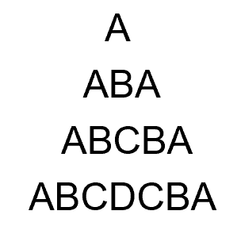
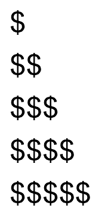

# PPT，page 96-102

1、指出以下程序的不妥之处。

```c
int main(void)
{
	int i = 1,		//i没有赋值成功，应该用分号而不是逗号
	float n;
	printf(“watch out! Here come a bunch of fraction!\n”);
	while(i<30)
	n = 1/i ;		//i的值一直没变会进入死循环
	printf(“%f”, n);
	printf(“That’s all, folks!\n”);
	return;			//这里return后面需要接返回值0或者非零
}
```

2 、在程序中实现以下表达式，观察运算后a的值并解释原因。(设原来a=12)

(1) `a += a`		 ---> a=24，因为a = a + a，所以a = 24

(2) `a -= 2`		---> a = 10，因为a = a - 2，所以a = 10

(3) `a *= 2+3`	----> a = 60，因为a = a * (2+3)，所以a = 60

(4) `a /= a+a`	----> a = 0， 因为a = a/(a+a)， 即12/24，得0.5，数据类型为int，所以a = 0

(5) `a %= (n%2)`，n的值为5	---->a = 0，因为a = a % (5%2)，即 12 % 1，得0

(6) `a += a -= a *= a`

3、请写出下列代码的输出内容

```c
#include <stdio.h>

int main(void)
{
	int a, b, c, d;
	a = 10;
	b = a++;	//10
	c = ++a;	//12
	d = 10 * a++;	//120

	printf("b, c, d: %d, %d, %d\n",b, c, d);	//b, c, d: 10, 12, 120

	return 0;
}
```

4、编写一个程序，该程序要求输入一个float型数并打印该数的立方值。使用你自己设计的函数来计算该值的立方并且将它的立方打印出来。main函数负责把输入的值传递给该函数。

```c
#include <stdio.h>

float power3(float x);

int main(void)
{
	float x;
	int ret;
	printf("Number to multiplied to the power of 3, enter a floating point number:");
	ret = scanf("%f", &x);
	if (ret != 1)
	{
		printf("wrong input.\n");
		return -1;
	}

	printf("The %f to the power of 3 is: %f.\n", x, power3(x));

	return 0;
}

float power3(float x){
	x = x * x * x;
	return x;
}
```

5、编写一个程序，此程序要求输入天数，然后将该值转换为星期数和天数。例如输入18，则要求输出：`18 days are 2 weeks, 4days.`

```c
int main(void)
{
	int days;
	printf("Enter the number of days:");
	scanf("%d", &days);

	printf("%d days are %d weeks, %ddays.\n", days, days / 7, days % 7);
	return 0;
}
```

6、编写一个程序，接受一个整数输入，然后显示所有小于或等于该数的素数。

```c
int main(void)
{
	int num = 0;
	printf("Enter an interger less than 10000:");
	scanf("%d", &num);

	if (num >= 2 && num <10000)
	{
		// 将偶数排除
		int arr[5000] = {0};
		arr[0] = 2;
		printf("%d\n", arr[0]);

		for (int i = 3; i <= num; i += 2)
		{ // 从3开始的奇数 开始寻找素数
			for (int j = 1; j < num; j++)
			{
				if (arr[j] == 0)
				{ // 存入素数并打印
					arr[j] = i;
					printf("%d\n", arr[j]);
					break;
				}
				else if (i % arr[j] == 0)
				{//可被整除，跳出循环
					break;
				}
			}
		}
	}

	return 0;
}

```

7、编写一个程序，用户输入某个大写字母，产生一个金字塔图案。例如用户输入字母D，则产生如下图案：



```c
int main(void)
{
	char ch;
	int ret;
	printf("Enter a capital character:");

	ret = scanf("%c", &ch);
	if (ret != 1)
	{
		printf("wrong input.\n");
		return -1;
	}

	// printf("amount: %d\n", ch - 64);

	for (int i = 1; i <= ch - 64; i++)
	{
		//打印空格
		for (int j = ch - 64 - i; j > 0; j--)
		{
			printf(" ");
		}

		//打印递增字母
		for (int k = 1; k <= i; k++)
		{
			printf("%c", 64 + k);
		}

		//打印递减字母
		for (int l = 2; l <= i; l++)
		{
			printf("%c", 65 + i - l);
		}

		printf("\n");
	}

	return 0;
}
```

8、使用嵌套循环产生下列图案：


```c
int main(void)
{
	int height;
	printf("Enter the height of the triangle:");
	scanf("%d", &height);

	for (int i = 0; i < height; i++)
	{
		for (int j = 0; j <= i; j++)
		{
			printf("$");
		}

		printf("\n");
	}


	return 0;
}
```

9、输入一个华氏温度，要求输出摄氏温度。要求结果保留2位小数。转换公式为：c = 5(F-32)/9

```c
int main(void)
{
	float F, C;
	printf("Enter the temperature in Fahrenheit:");
	scanf("%f", &F);

	C = 5 * (F - 32) / 9;
	printf("Temperature in Fahrenheit: %.2f\n", F);
	printf("Temperature in degrees Celsius: %.2f\n", C);

	return 0;
}
```

10、说明函数传参的方式和异同。

可以值传递或者址传递

11、编写一个函数，使其返回3个整型参数中的最大值。

```c
int maxOfThree(int a, int b, int c){
	int result;
	result = (a > b ? a : b) > c ? (a > b ? a : b) : c;
	return result;
}
```

12、编写一个函数my_power，用循环的方法实现返回一个float类型数的某个整数次幂(保留6位小数)。如调用my_power(3.14,-2)返回0.101424

```c
float my_power(float x, int n)
{
	if (n != 0)
	{
		if (n > 0)
		{
			for (int i = 0; i < n-1; i++)
				x = x * x;
		}

		if (n < 0)
		{
			for (int i = 0; i < -(n+1); i++)
				x = x * x;
			x = 1 / x;
		}
	}
	else
		x = 1;

	return x;
}
```

13、编写一个程序，将两个字符串连接起来，不要用strcat函数。

```c
int main(void)
{
	char arr1[] = "Hello World!\n";
	char arr2[] = "This is Gabbi.\n";

	char result[100] = {0};
	int index;
	for (int i = 0; i < 100; i++)
	{//将arr1赋值给新的一个数组result
		result[i] = arr1[i];
		if (arr1[i] == '\0')
		{
			index = i;
			break;
		}
	}

	for (int j = 0; j < 100; j++)
	{//将arr2继续赋值给新的一个数组result
		result[index + j] = arr2[j];

		if (arr2[j] == '\0')
		{
			result[index +j] = '\0';
			break;
		}
	}

	printf("%s", result);
}
```

# 练习题day03

1、`int a[] = {0, 1, 2, 3, 4, 5, 6, 7, 8, 9},*p = a, i;`
其中0<=i<=9,则对a数组元素的引用不正确的是	---->	`*(*(a+i))`
`a[p-a]`    `*(&a[i])`    `p[i]`    `*(*(a+i))`

2、给数组所有元素输入数据：	---->	a+(i++)

```c
int a[10], i=0;
while(i<10)
    scanf("%d",    );
```

应填入：
a+(i++)    &a[i+1]     a+i      &a[++i]

3、

```c
int a[10] = {1, 2, 3, 4, 5, 6, 7, 8, 9, 10}, *p = a;
printf("%d\n", *(p + 2));
```

程序输出结果是	---->	3
3      4       1      2

4、

```c
int a[] = {2, 4, 6, 8, 10}, y = 1, x, *p;
p = &a[1];			//4的地址
for (x = 0; x < 3; x++)		//循环三次
	y += *(p + x);
printf("%d\n", y);
```

程序的输出结果为---->	y = y + *(p + x) --> 1 + 4 --> 5 + 6 --> 11 + 8 --> 19
17           18           19             20

5、若有定义int c[4][5],(*cp)[5];和语句cp=c;,则能正确引用c数组元素的是
cp+1        *(cp+3)       *(cp+1)+3              *(*cp+2)

6、若有定义：`int x, *pb;` 则正确的赋值表达式是		---->	pb=&x
pb=&x     pb=x    *pb=&x      *pb=*x

7、`printf("%d\n", NULL);` 输出结果是		---->	0
因变量无定义输出不定值     0       -1       1

8、

```c
void sub(int x, int y, int *z)
{
	*z = y - x;
}

int main(void)
{
	int a, b, c;
	sub(10, 5, &a);	//a = -5
	sub(7, a, &b);	//b = -5-7 = -12
	sub(a, b, &c);	//c = -12 -(-5) = -7
	printf("%d,%d,%d\n", a, b, c);

	return 0;
}
```

程序输出结果是	---->	-5，-12，-7
5,2,3      -5，-12，-7      -5，-12，-17      5，-2，-7

9、

```c
int main(void)
{

	int k = 2, m = 4, n = 6, *pk = &k, *pm = &m, *p;
	n = k * (m);
	printf("%d\n", n);

	return 0;
}
```

程序输出结果为	---->	8
4       6      8        10

10、

```c
void prtv(int *x)
{
	printf("%d\n", ++*x);
}

int main(void)
{
	int a = 25;
	prtv(&a);
}
```

程序输出结果是	---->	26
23     24      25      26

11、

```c
void sub(double x, double *y, double *z)
{
	*y = *y - 1.0;
	*z = *z + x;
}
int main(void)
{
	double a = 2.5, b = 9.0, *pa, *pb;
	pa = &a;	//*pa = a = 2.5
	pb = &b;	//*pb = b = 9.0
	sub(b - a, pa, pa);	//pa = 2.5 - 1 = 1.5, pa = pa + (b - a) = 1.5 + 6.5 = 8.0
	printf("%f\n", a);

	return 0;
}
```

程序的输出结果是	---->	8.000000
9.000000      1.500000     8.000000      10.500000

12、设有定义语句：char a='\72';，则变量a	---->	包含1个字符
包含1个字符     包含2个字符     包含3个字符       定义不合法

13、C语言中，下列不合法的字符常量是		---->	~~'\xff'~~		'&'
'\xff'      '\65'      '&'     '\028'

14、C语言中，下列不合法的字符串常量是	---->	'y='
“\121”    'y='    "\n\n"    "ABCD\x6d"

15、判断char型变量c是否为大写字母的最简单且正确的表达式是	---->	(c>='A')&&(c<='Z')
‘A’<=c<='Z'      (c>='A')||(c<='Z')      ('A'<=c)AND('Z'>=c)          (c>='A')&&(c<='Z')

16、

```c
char x = 'A';
x = (x >= 'A' && x <= 'Z') ? (x + 32) : x;
printf("%c\n", x);
```

程序的输出结果是	---->	a
A        a          Z        z

17、以下能正确进行字符串赋值、赋初值的语句组是	----> 	~~A 		C 		D~~		B
char s[5]={'a','e','i','o','u'};  //字符数组
char *s;s="good!";
char s[5]="good!";		//存不下
char s[5];s="good"；	一旦定义了数组，只能通过下标的方式进行赋值

18、设有定义：`char str[] = "ABCD", *p = str;` 则语句 `printf("%d\n", *(p+4));` 的输出结果是		---->	0
68       0       字符D的地址          不确定的值

19、语句 `printf("%d\n",strlen("ATS\n012\1\\")); ` 的输出结果是		---->	9
11      10        9        8

20、

```c
void fun(char *w, int m)
{
	char s, *p1, *p2;
	p1 = w;
	p2 = w + m - 1;
	while (p1 < p2)
	{
		s = *p1++;
		*p1 = *p2--;
		*p2 = s;
	}
}

main()
{
	char a[] = "ABCDEFG";
	fun(a, strlen(a));
	puts(a);
}
```

程序运行后的输出结果是		---->	AGAAGAG
GFEDCBA         AGADAGA               AGAAGAG           GAGGAGA

21、设有定义语句：char * aa[2]={"abcd","ABCD"};
则以下叙述正确的是		---->	D
aa数组元素的值分别是字符串“abcd”“ABCD”
aa是指针变量，他指向含有两个数组元素的字符型一维数组
aa数组的两个元素分别存放的是含有四个字符的一维数组的首地址
aa数组的两个元素中各自存放‘a’和‘A’的地址。。

22、若变量已正确定义，在执行以下while语句时，输入字符A后，ch的值是	---->	0
while(ch=getchar()=='A');

23、以下fun函数的功能是将一个字符串的内容颠倒过来，请填空。

```c
#include <stdio.h>
#include <string.h>

void fun(char str[5])
{
	int i, j, k;
	for (i = 0, j = 4; i < j; i++, j--)
	{
		k = str[i];
		str[i] = str[j];
		str[j] = k;
	}
}
```

24、编写函数，对具有10个整数的数组进行如下操作：从下标为n的元素开始s直到最后一个元素，依次向前移动一个位置。输出移动后的结果

```c
#include <stdio.h>

void moveForward(int* arr, int n)；

int main(){
	int arr[10] = {0, 1, 2, 3, 4, 5, 6, 7, 8, 9};
	moveForward(arr, 4);

	for (int i = 0; i < sizeof(arr) / sizeof(int); i++)
	{
		printf("%d ", arr[i]);
	}
	printf("\n");
	return 0;
}

void moveForward(int* arr, int n){ 
	for (int i = 1; i <= n; i++)
	{
		arr[i - 1] = arr[i];
	}
}
```

25、编写函数，对字符数组中的字母按由大到小的字母顺序进行排序。

```c
void bubbleSort(char *arr, unsigned int size)
{
    char tmp;
    int go_on = 1;
    int edge = 0;

    while (go_on)
    {
        go_on = 0;
        for (int i = 0; i < size - 1 - edge; i++)
        {
            if (arr[i] < arr[i + 1])
            {
                tmp = arr[i + 1];
                arr[i + 1] = arr[i];
                arr[i] = tmp;
                go_on = 1;
            }
        }

        edge++;
    }
}

void bubbleSort2(char *arr, unsigned int size)
{
    char tmp;
    int done = 1;

    for (int i = 0; i < size - 1; i++)
    { 
        if (arr[i] < arr[i + 1])
        {
            tmp = arr[i + 1];
            arr[i + 1] = arr[i];
            arr[i] = tmp;
            done = 0;
        }
    }

    if (done)
    {
        return;
    }else{
        bubbleSort2(arr, size - 1);
    }
  
}


int main(void)
{
    char arr[10] = {'a', 'g', 't', 'e', 't', 's', 'y', 'u', 'q', 'c'};

    bubbleSort2(arr, 10);
    for (int i = 0; i < 10; i++)
    {
        printf("%c ", arr[i]);
    }
    printf("\n");

    return 0;
}
```

26、编写函数，把数组中所有奇数放在另一个数组中返回。

```c
int pickOdds(int *arr1, unsigned int n1, int *arr2, unsigned int n2);

int main(void)
{
    int arr1[8] = {4, 7, 2, 6, 5, 9, 3, 33};
    int arr2[8];

    pickOdds(arr1, 8, arr2, 8);

    for (int i = 0; i < 8; i++)
    {
        if (arr2[i] == 0)
            break;

        printf("%d ", arr2[i]);
    }

    printf("\n");
}

/**
 * function: to put the odds number from arr1 to the arr2
 * size1 is the size of arr1
 * size2 is the size of arr2
 * size2 must no less than size1
 * if the odds num less than size2, the rest of it will be set to 0
 **/
int pickOdds(int *arr1, unsigned int size1, int *arr2, unsigned int size2)
{

    // size2 must no less than size1
    if (size2 < size1)
    {
        return -1;
        printf("Error: size2 must be equal or larger than size1!\n");
    }

    int i, j = 0; // i for index of arr1, j for index of arr2

    // to find the odds num from arr1 and put it into arr2
    for (i = 0; i < size1; i++)
    {
        if (arr1[i] % 2 == 1)
        {
            arr2[j++] = arr1[i];
        }
    }

    //the rest of the elements of arr2 will be set to 0
    while (j < size2)
    {
        arr2[j++] = 0;
    }

    return 0;
}
```

27、请编写函数，其功能是对传送过来的两个浮点数求出和值与差值，并通过形参传送回调用函数。

```c
void addSubOf2float(float* x, float* y);

int main(void){
    float x = 5.22;
    float y = 3.44;
    printf("x: %f, y: %f\n", x, y);

    addSubOf2float(&x, &y);
    printf("x: %f, y: %f\n", x, y);

    return 0;
}

/**
 * to caculate the sum of x and y and assign to x
 * to caculate the difference of x and y and assign to y
**/
void addSubOf2float(float* x, float* y){
    float* px = x;
    float* py = y;
    float tmp = *x;

    *px = *x + *y;    // calculate the sum value of x and y
    *py = tmp - *y;  // calculate the difference of x and y
}
```

28、请编写函数，对传送过来的三个数选出最大数和最小数，并通过形参传回调用函数。

```c
void maxAndminValue(int a, int b, int c, int* max, int* min);

int main(void){
    int a = 9, b = 160, c = 97;
    int max, min;
    printf("a: %d, b: %d, c: %d\n", a, b, c);

    maxAndminValue(a, b, c, &max, &min);
    printf("a: %d, b: %d, c: %d\n", a, b, c);
    printf("max: %d, min: %d\n", max, min);

}

void maxAndminValue(int a, int b, int c, int* max, int* min){
    *max = (a > b? a: b) > c? (a > b? a: b): c;
    *min = (a < b? a: b) < c? (a < b? a: b): c;
}
```

29、请编写程序，输入一行字符，输出每个字符以及与之对应的ASCII代码值，每行输出三对。

```c
int main(void){
    char str[100];
    scanf("%s", str);

    for (int i = 0; i < 100; i++)
    {
        if (str[i] == '\0')
        {
            break;
        }
      
        printf("%c: %d   ", str[i], str[i]);
        if ((i+1) % 3 == 0)
        {
            printf("\n");
        }  
    }
    printf("\n");
  
    return 0;
}
```

30、请编写程序统计输入的行数，用!号结束输入，！号所在行不计入行数

31、请编写程序统计输入的一行中小写字母的个数

32、请编写输出以下图案的程序，图案的行数由输入的整数值确定。

```
         A
        BBB
       CCCCC
      DDDDDDD
     EEEEEEEEE
        ...
```

 代码如下：

```c
int printCapAlphabet(int n);

int main(void){
    int n;
    scanf("%d", &n);
    printCapAlphabet(n);

    return 0;
}

int printCapAlphabet(int n){
    if (n > 26)
        return -1;

    for (int i = 1; i <= n; i++)
    {
        //printf space
        for (int j = 1; j <= n - i; j++)
        {
            printf(" ");
        }
      
        //printf capital alphabet
        for (int k = 1; k <= 2 * i - 1; k++)
        {
            printf("%c", 64 + i);
        }

        printf("\n");  
    }
  
    return 0;
}
```

33、请编写输出以下图案的程序。

```
      A
     ABA
    ABCBA
   ABCDCBA
```

见PPT第7题

34、请编写函数mygets和myputs，其功能分别与gets和puts相同，函数中用getchar和putchar读入和输出字符。

35、请编写函数，判断一字符串是否是回文。若是回文，函数返回值为1；否则返回值为0。回文是顺读和倒读都一样的字符串。

```c
#include <stdio.h>
#include <string.h>

int palindrome(char *str, unsigned int n);

int main(void)
{
    char *str = "agdtdtdga";
    unsigned int n = strlen(str);
    // printf("n: %d\n", n);
    int x = palindrome(str, n);
    printf("palindrom: %d\n", x);
}

//n is the size of the str
int palindrome(char *str, unsigned int n)
{
    int flag = 1;       //palindrom yes
    for (int i = 0; i < n / 2; i++)
    {
        if (str[i] != str[n - 1 - i])
        {
            flag = 0;   //palindrom no
            return flag;
        }
    }
    return flag;
}
```

36、请编写函数，删除字符串中指定位置（下标）上的字符。删除成功函数返回被删字符；否则返回空值。

```c
#include <stdio.h>
#include <string.h>

char deleteChar(char *str, unsigned int size, int index);

int main(void)
{
    char str[] = "I'm Happy now!";
    unsigned int size = strlen(str);
    int n = 13;
    char a = deleteChar(str, size, n);
    printf("a: %c\n", a);
    printf("s: %s\n", str);

    return 0;
}

char deleteChar(char *str, unsigned int size, int n)
{
    if (n >= size)
    {
        return 0;
    }

    char a = str[n];

    for (int i = 0; i < size - n; i++)
    {
        str[n + i] = str[n + i + 1];
        if (str[n + i] == '\0')
        {
            return a;
        }
    }

    return 0;
}
```
