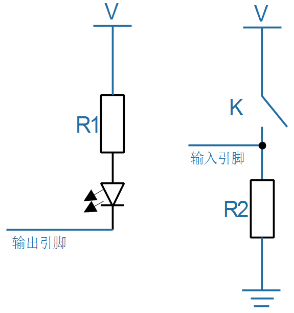
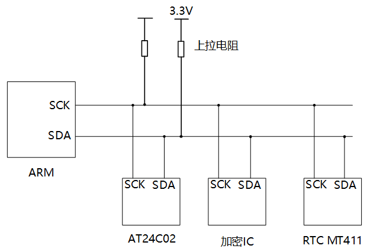
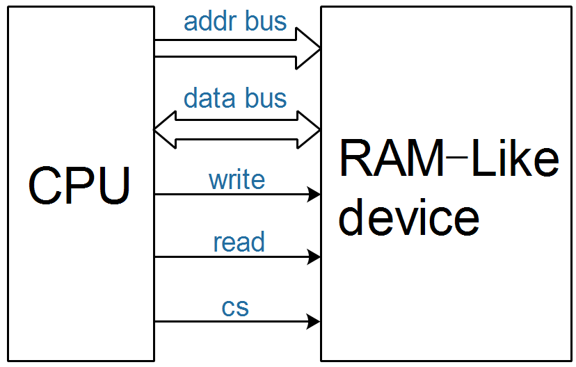
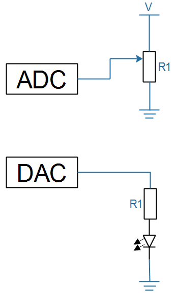

## 硬件接口的四大类

参考书籍：

* 《微机原理》：侧重于计算机结构
* 《数字电子技术基础 》：侧重于门电路

### 1. GPIO和门电路

GPIO：general peripheral input/ouput，通用的外设输入、输出接口。

这类电路通常只使用一个引脚：

* 可以设置为输出
  * 可以输出高、低电平
  * 比如用来控制LED
* 也可以设置为输入
  * 可以读取引脚电平，判断当前是高电平还是低电平
  * 比如用来判断按键是否被按下
* 可以接上各类晶体管(二极管、三极管等)实现逻辑运算

* 例子
  

### 2. 协议类

比如：UART、I2C、SPI、Nand、TFT LCD。
如果两个设备之间要传输的数据比较复杂，可以约定一些规则。这类接口被称为"协议类"接口。
当然可以只使用一条GPIO引脚来传输复杂的数据，比如红外遥控器、温度传感器等。
也可使用多条线路来传输数据，比如UART、I2C、SPI等。
比如TFT LCD的接口线将近30条。
例子：

* I2C接口

  * 硬件连接
    

  * I2C协议
    

### 3. 类似内存的接口(ram-like)

比如：Nor Flash、SDRAM、DDR、网卡DM9000等。

* 内存：可以读写某个地址上的数据，所以必定有这些信号
  * 地址总线
  * 数据总线
  * 读/写信号
  * 片选：ram-like接口上可以接多个设备，互相之间不能干扰，选中哪个设备哪个设备才能响应
* 很多设备也采用类似内存的接口，比如Nor Flash、8080接口的LCD
* 例子
  

### 4. 模拟电路

数字电路上传输的电压值只有2类取值，比如

* 2.xV到3.3V，抽象为逻辑值1
* 0V到1.xV，抽象为逻辑值0

模拟电路上传输的电压可以是各种各样的，比如以下两个电路：

* ADC电路中：可以读取滑动电阻器上的触点电压值
* DAC电路中：可以输出不同的电压值，用来控制LED的亮度(数字电路里LED只有亮、灭两个状态)

