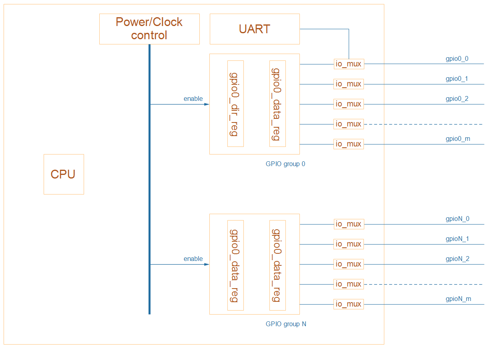
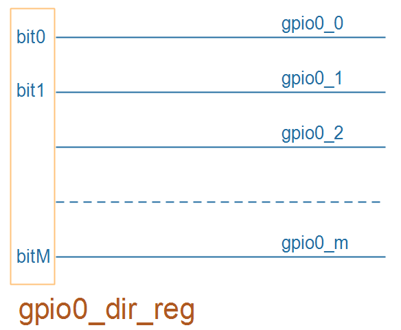
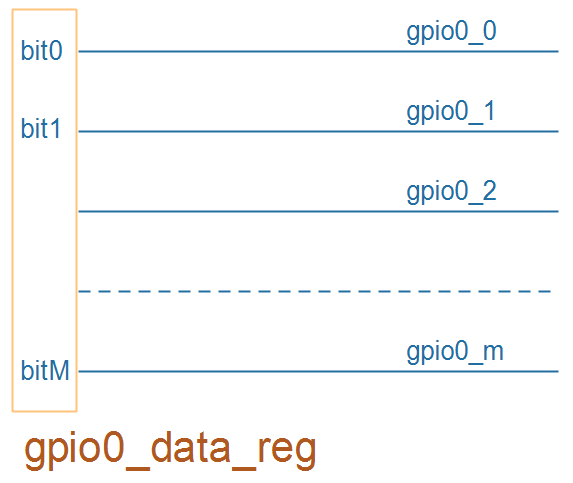
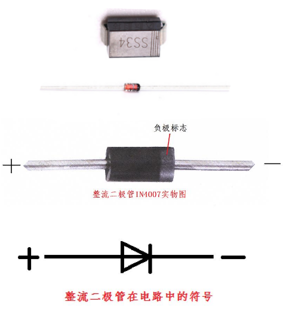
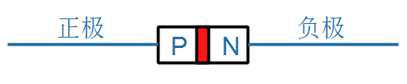
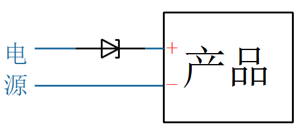
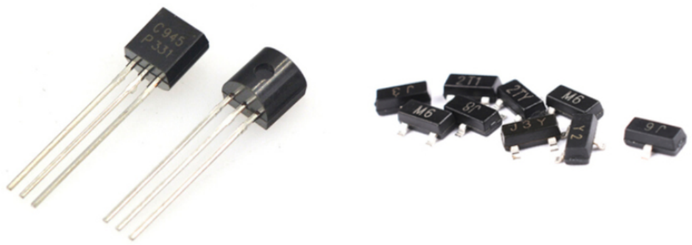
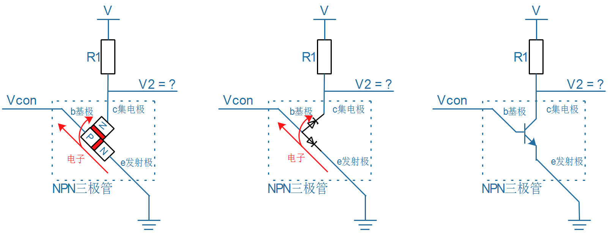
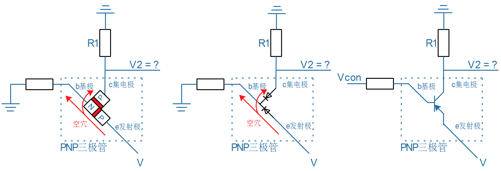

## GPIO与门电路

### 1. GPIO的应用

GPIO可以设置为输出、输入：

* 输出功能

  * LED

  * 发射红外信号

  * 控制电机

  * 蜂鸣器

  * 数码管

* 输入功能

  * 按键
  * 接收红外信号
  * 人体感应
  
* 实现各类协议
  * 读取温湿度传感器数据
  * 其实UART等也是使用GPIO来实现的

###  2. GPIO引脚操作

怎么用一个GPIO来控制LED？换句话说，怎么让一个GPIO输出高、低电平？

#### 2.1 设置引脚为GPIO功能

芯片内部有很多模块，比如GPIO、UART(串口)。
一个引脚，可以接到模块A，也可以接到模块B，比如上图中的引脚gpio0_0，可以接到GPIO group 0，也可以接到UART。
可以设置某些寄存器(比如io_mux)，选择引脚的功能。

#### 2.2 设置引脚方向

假设一个引脚被设置成了GPIO功能，那么它是用作输出，还是输入？
在GPIO模块内部，一般都有一个方向选择寄存器，里面每一位用来控制一个引脚的方向。
比如GPIO group 0中有一个gpio0_dir_reg寄存器，

* 它的bit 0写入1，表示gpio0_0被设置为输出
* 它的bit 0写入0，表示gpio0_0被设置为输入

#### 2.3 设置/读取引脚数值

一个GPIO引脚被设置成输出，那么怎样设置它的输出电平？
一个GPIO引脚被设置成输入，那么怎样读取它的输入电平？
在GPIO模块内部，一般都有一个数据寄存器，里面每一位用来控制一个引脚的输出电平。
比如GPIO group 0中有一个gpio0_data_reg寄存器，

* 写数据
  * 它的bit 0写入1，表示gpio0_0输出高电平
  * 它的bit 0写入0，表示gpio0_0输出低电平
* 读数据
  * 如果bit 0等于1，表示gpio0_0为高电平
  * 如果bit 0等于0，表示gpio0_0为低 电平

### 3. 二极管

参考资料：[图文详解二极管原理](https://blog.csdn.net/u012184539/article/details/84869834)

* 二极管的箭头表示正向电流的方向
* 二极管的电流具有单向性
* 假设正极、负极之间的电压为V
  * 当V大于某个阈值(比如0.7V)，二极管就导通，导通时电阻约等于0
  * 当V<0，二极管不会导通，电阻无穷大
* 内部结构如下：由PN节组成，P代表正极(positive)，N代表负极(negative)
  

* 二极管中流动的是电子，电流方向是从正极到负极，电子流动的方向是从负极到正极

* 使用二极管

  * 比如：使用二极管防止电源接反是烧坏电路

  

### 4. 三极管

参考资料：[三极管工作原理分析精辟透彻看后你就懂](https://wenku.baidu.com/view/14bf31be81d049649b6648d7c1c708a1284a0abb.html)

可以使用二极管的特性制作成三极管，组成开关电路。

三极管实物图：

三极管可以分为：NPN三极管、PNP三极管。

#### 4.1 NPN三极管

* 扩散
  * 物质会从浓度大的地方扩散到浓度低的地方
  * 比如墨水滴入水中，墨水会四处散开
  * 比如臭味会四处散开
  * 电子也会有扩散作用
* 三极管原理
  * 当be之间的PN节加上正向电压，电子从e极的'N'大量往‘P’移动(所以e被称为发射极)
  * 电子在'P'大量聚集，一部分通过b极流走，另一部分通过c极扩散出去(c起收集作用，所以被称为集电极)
    * 电子流动方向如图中红色箭头所示
    * 电流方向与电子流动方向相反：be之间电流从b到e，ce之间电流从c到e
* 三极管的使用
  * 当Vcon等于0.7V左右，be之间的PN节打通，c极相当于直接连接e，V2=0
  * 当Vcon等于0V，be之间的PN节没打通，c极相当于断开，V2=V
  * 所以，可以用Vcon来控制V2

#### 4.2 PNP三极管

* 扩散
  * 物质会从浓度大的地方扩散到浓度低的地方
  * 比如墨水滴入水中，墨水会四处散开
  * 比如臭味会四处散开
  * 电子也会有扩散作用
* 三极管原理
  * 当eb之间的PN节加上正向电压，空穴从e极的'N'大量往‘P’移动(所以e被称为发射极)
  * 空穴在'P'大量聚集，一部分通过b极流走，另一部分通过c极扩散出去(c起收集作用，所以被称为集电极)
    * 空穴流动方向如图中红色箭头所示
    * 电流方向与空穴流动方向相同：eb之间电流从e到b，ec之间电流从e到c
* 三极管的使用
  * 当Vcon为高电压(比如3.3V)，eb之间的PN节打通，c极相当于直接连接e，V2=Vcon
  * 当Vcon等于0V，eb之间的PN节没打通，c极相当于断开，V2=0
  * 所以，可以用Vcon来控制V2

