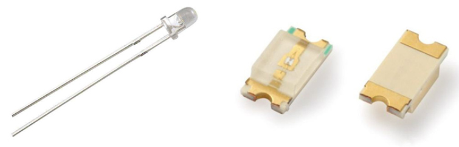
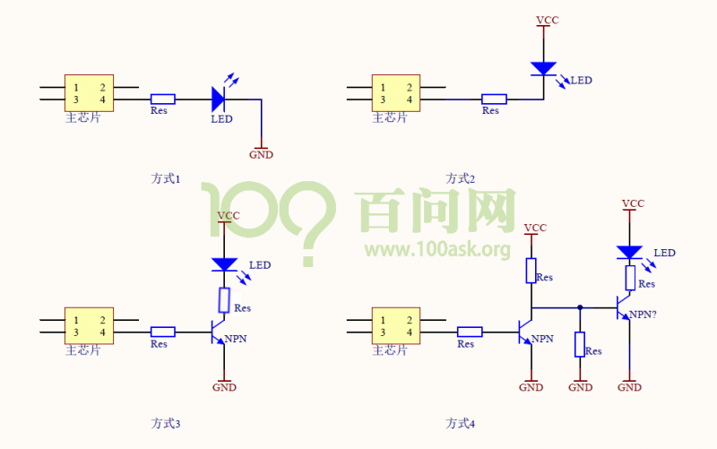

## LED电路与操作

### 1. LED实物

### 2. LED电路

* 方式1
  * 芯片引脚输出高电平，LED被点亮
  * 芯片引脚输出低电平，LED被熄灭
  * 缺点：芯片引脚的驱动能力可能不够，LED亮度低
* 方式2
  * 芯片引脚输出低电平，LED被点亮
  * 芯片引脚输出高电平，LED被熄灭
  * 缺点：电流进入芯片过大时，可能烧毁芯片
* 方式3
  * 芯片引脚输出高电平，三极管导通，LED被点亮
  * 芯片引脚输出低电平，三极管不导通，LED被熄灭
* 方式4
  * 芯片引脚输出低电平，第一个三极管不导通，第二个三极管导通，LED被点亮
  * 芯片引脚输出高电平，第一个三极管导通，第二个三极管不导通，LED被熄灭

