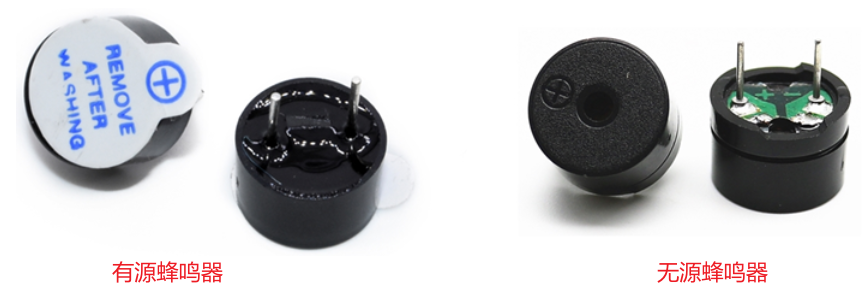
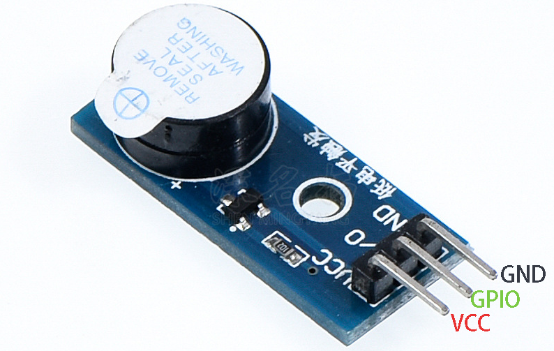

## 蜂鸣器电路与操作

### 1. 蜂鸣器

蜂鸣器是一种常见的电子发声元器件，采用直流电压供电，广泛应用于计算机、打印机、报警器、电子玩具、汽车电子设备等产品中。

常见的蜂鸣器可分为有源蜂鸣器和无源蜂鸣器，这里的"源"不是电源，而是震荡源：

* 有源蜂鸣器：内部有震荡源，只要通电即可自动发出固定频率的声音。
* 无源蜂鸣器：内部无震荡源，单是通电并不会发声，需要使用周期性的脉冲才可以发声，声音频率可变。

两种蜂鸣器实物如下图所示，从外观上来看两种蜂鸣器形状相似：

* 有源蜂鸣器底部有黑胶密封
* 无源蜂鸣器底部可看到电路板（图中绿色部分）
* 两种蜂鸣器都标注有正负极

### 2. 蜂鸣器电路

下图是一个有源蜂鸣器模块：

它的原理图如下：

* 当GPIO为低电平时，PNP三极管导通，蜂鸣器正极电压等于VCC，蜂鸣器发出声音。
* 当GPIO为高电平或悬空时，PNP三极管不导通，蜂鸣器正极电压相当于没接线，蜂鸣器不会发出声音。

