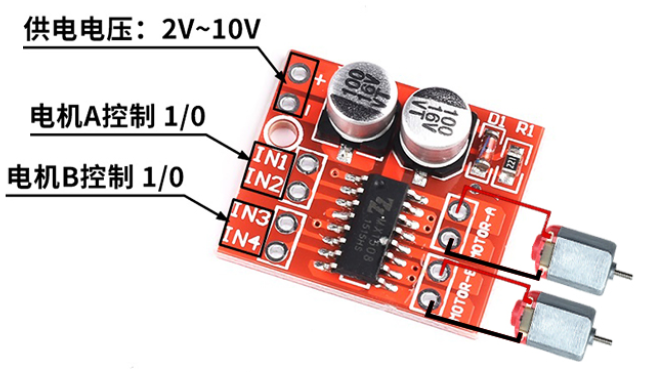
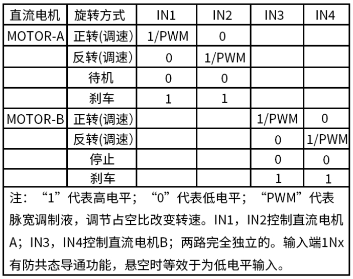
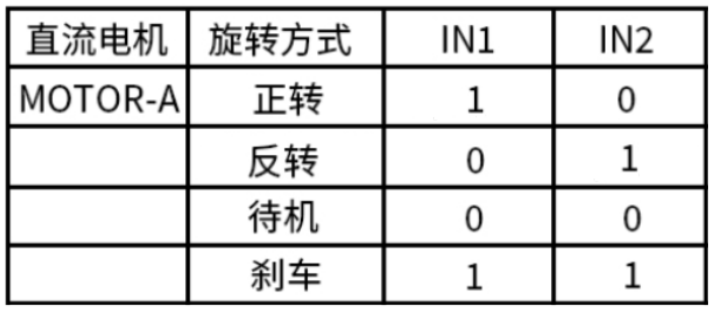
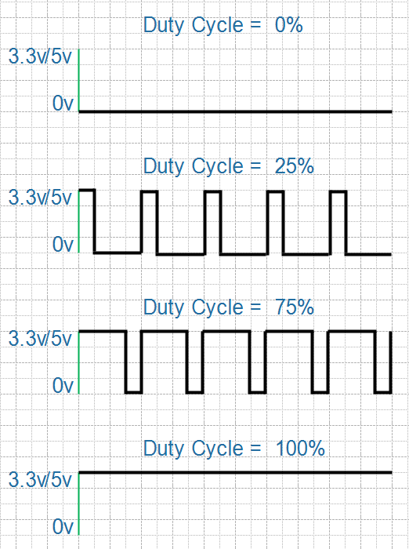
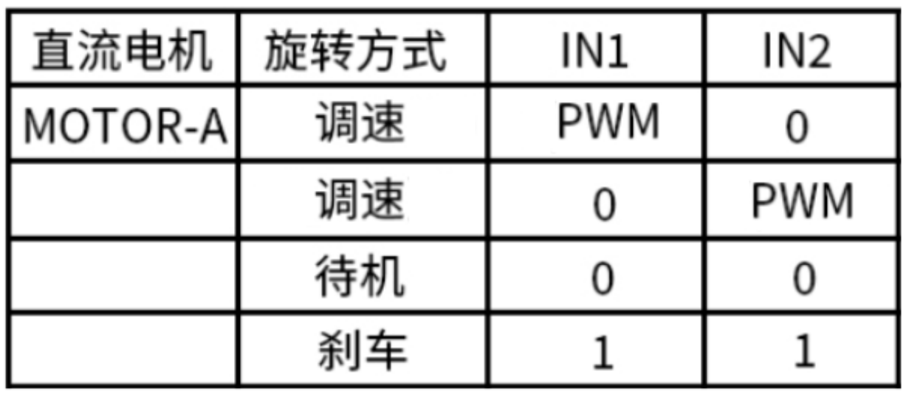

## 电机驱动板

### 1. 电机驱动板接口与操作方法

电机驱动板接口如下：

它可以用来控制2个马达：

* IN1和IN2用来控制motor-A
* IN3和IN4用来控制motor-B

控制马达时，可以让它正转、反转、待机、刹车，控制信号如下图所示：

### 2. 控制一个马达

#### 2.1 接线

* 电源：把电源接到板子的"+"、"-"引脚
* 马达：把马达接到motor-A的连个引脚
* 控制信号：使用两个GPIO接到IN1、IN2

#### 2.2 使用高低电平控制

使用高低电平进行控制时，正转或反转时，电机使用的是最高的速度。
如果想调整速度，需要使用PWM波。

#### 2.3 使用PWM控制速度

PWM：Pulse width modulation，脉冲宽度调制。简单地说就是周期性地输入高低电平，得到如下波形：

在一个周期中，高电平的时间占比被称为"占空比"：

* 当占空比为0时，表示引脚输出恒为低电平
* 当占空比为100%时，表示引脚输出恒为高电平

在点击控制板的IN1、IN2引脚上输入PWM波，就可以控制电机的速度。简单地说就是：一会让电机运转、一会让电机停止，调整运转和停止的比列就可以控制速度。由于运转、停止的间隔时间太短以致人们感觉不到马达有停顿。

