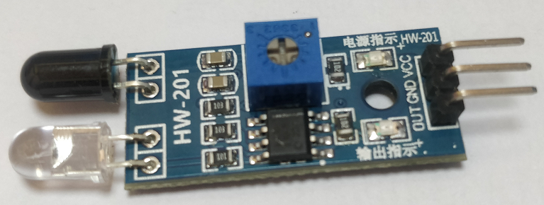

## 红外避障传感器模块

# 1. 模块介绍

红外避障传感器具有一对红外线发射与接收管，工作原理为：

* 发射管发射出一定频率的红外线
* 当检测方向遇到障碍物（反射面）时，红外线反射回来被接收管接收
* 正前方有障碍物时，绿灯亮起，OUT引脚为低电平；反之，绿灯熄灭，OUT引脚为高电平

缺点：由于日光是也含红外线，所以大多数便宜的红外模块在户外使用就会遇到问题。

### 2. 使用

通过VCC、GND给模块供电，供电电压为3.3V~5V。
读取OUT引脚电平即可判断前方是否有障碍物，可以旋转模块上的电阻器来调节阈值。

