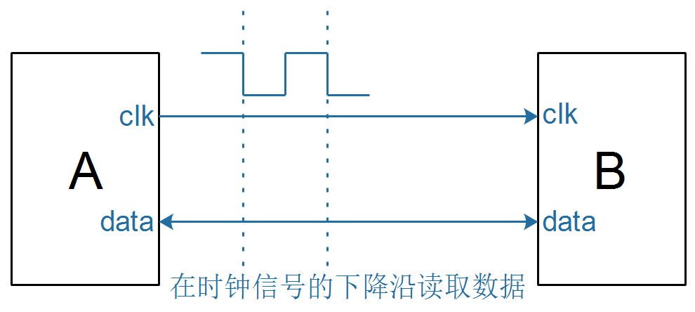
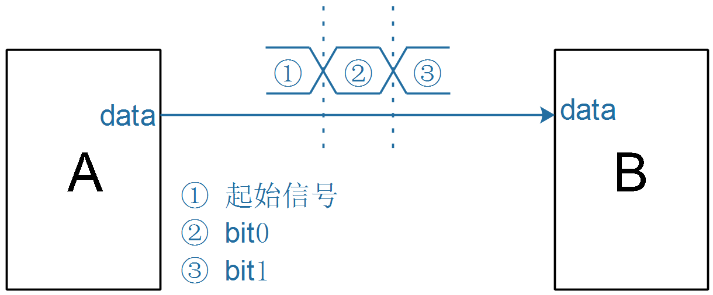
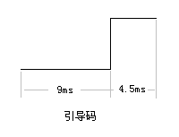
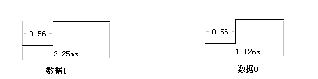

## 同步与异步

### 1. 概念

同步(**synchronous**)、异步(**asynchronous**)，使用生活例子来说就是：

* 同步：朋友打电话说到我家吃饭，我在家里等他们
* 异步：朋友没有提前打招呼，突然就到我家来了

#### 1.1 同步信号示例

在电子产品中，使用**同步信号**进行传输时，一般涉及两个信号：

* 时钟信号：用来通知对方要读取数据了
* 数据信号：用来传输数据

比如：

* 时钟信号：打电话，起约定作用
* 数据信号：传输数据

#### 1.2 异步信号示例

使用异步信号传输数据时，双方遵守相同的约定：

* 起始信号：发送方可以通知接收方"注意了，我要开始传输数据了"

* 数据的表示

  * 怎么表示逻辑1
  * 怎么表示逻辑0

以红外遥控器解码器为例，它向单片机发出的数据格式如下：

* 起始信号：解码器发出一个9ms的低电平、4.5ms的高电平，用来同时对方说"开始了"
  

* 表示一位数据

  * 逻辑1：0.56ms的低电平+1.69ms的高电平
  * 逻辑0：0.56ms的低电平+0.56ms的高电平

  

* 接收方、发送方都遵守这样的约定，就可以使用一条线传输数据

### 2. 差别

|            | 同步传输                   | 异步传输           |
| ---------- | -------------------------- | ------------------ |
| 信号线     | 多：时钟信号、数据信号     | 少：只需要数据信号 |
| 速率       | 可变，提高时钟信号频率即可 | 双方提前约定       |
| 抗干扰能力 | 强                         | 弱                 |

