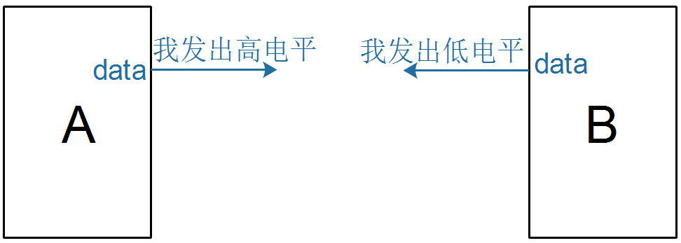
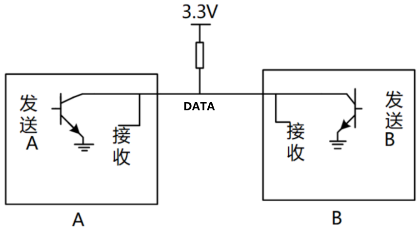

## 使用一线传输双向数据

### 1. 面临的问题

两个设备之间，只使用一条数据线，能否传输双向的数据？

* A发出高电平，B发出低电平
  * 电路可能被损坏
  * 电路上到底是高电平还是低电平？不能确定
* 问题在于：有两个设备试图**同时驱动**电路

### 2. 解决方法

不让双方**同时驱动**电路，或者即使**同时驱动**也没关系：

* 不让双方**同时驱动**电路：双方无法约定时间，此方法不可行
* 即使**同时驱动**也没关系：可行，电路如下：

真值表如下：

| A    | B    | DATA              |
| ---- | ---- | ----------------- |
| 0    | 0    | 1(由上拉电阻决定) |
| 0    | 1    | 0                 |
| 1    | 0    | 0                 |
| 1    | 1    | 0                 |

从真值表和电路图我们可以知道：

* 当某一个芯片不想影响SDA线时，那就不驱动这个三极管
* 想让DATA输出高电平，双方都不驱动三极管(SDA通过上拉电阻变为高电平)
* 想让DATA输出低电平，就驱动三极管

芯片内部的三极管，被称为open collector，开集，也就是在芯片内部三极管的集电极是开放的。
芯片内部不驱动三极管是，集电极的电平由外面的上拉电阻决定。

这种电路实现了：

* 双方设备即使同时想输出不同的电平：
  * 电路也不会被损坏
  * 电平也是确定的

### 3. 双向传输示例

* 初始状态：一开始，双方都不驱动三极管，DATA为高
* 起始信号和回应：A想传输数据给B，发出开始信号、得到回应信号
  * A检测DATA线，高表示对方没有占用数据线
  * A驱动三极管，使得DATA为低，用来通知B：我就要传输数据了
  * A释放三极管，DATA变为高
  * B驱动三极管，使得DATA为低，用来通知A：好的，我准备好了(这是一个回应信号)
  * B释放三极管，DATA变为高

* 传输：A发送数据给B，比如传输2位数据0、1
  * 双方都使用同一套数据表示方法，比如使用60US来传输一位数据，数值由DATA电平决定
  * 在第1个60us，A设置DATA为低；在同一时间，B读取DATA电平得到数据0
  * 在第2个60us，A设置DATA为高；在同一时间，B读取DATA电平得到数据1

* 结束：A释放三极管，DATA变为高电平
* 这时候，B也可以使用一样的方法给A传输数据