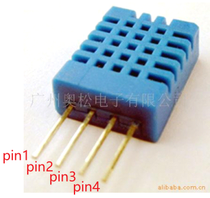
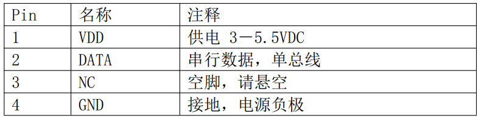
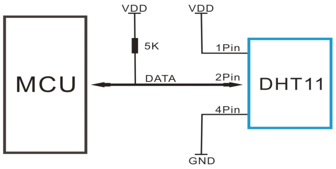
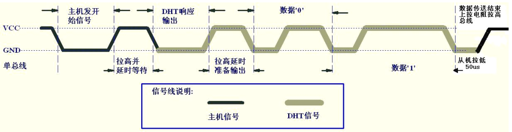
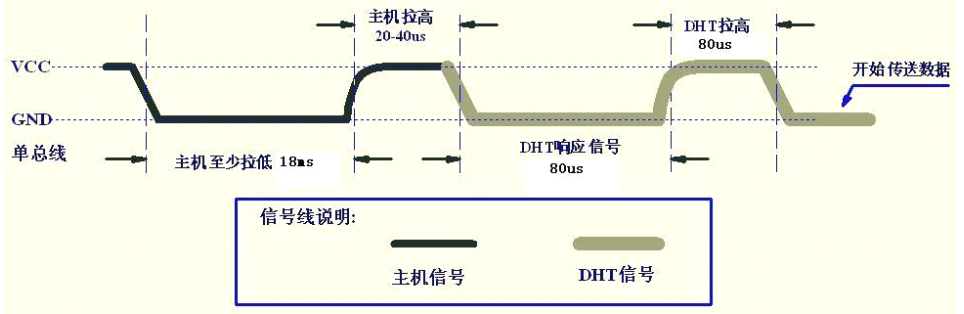
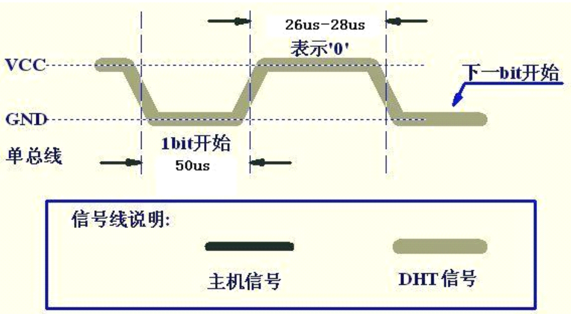
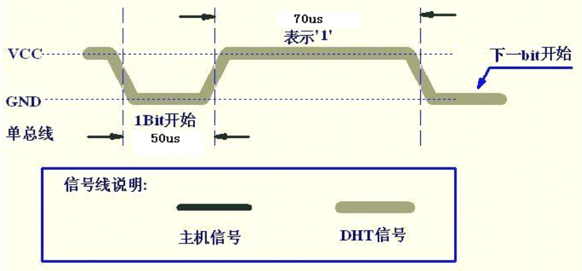

## DHT11温湿度传感器

参考资料：GIT仓库

* datasheet\DHT11-chinese(U3).pdf

### 1. 芯片介绍

简单地说，可以从DTH11中读取到温度值、湿度值。外形及引脚如下：

典型应用电路如下：

### 2. 数据格式

DHT11的data引脚用户传输数据，一次通讯时间为4ms作用，数据分为：整数部分、小数部分。
目前小数部分用具以后扩展，现读出为0。
一次完整的数据为40 bit，先传输高位：

* 格式为：8bit湿度整数数据 + 8bit湿度小数数据 + 8bit温度整数数据 + 8bit温度小数数据 + 8bit校验和
* 校验和 = "8bit湿度整数数据 + 8bit湿度小数数据 + 8bit温度整数数据 + 8bit温度小数数据" 所得结果的低8位

### 3. 通信协议

* 平时，DHT11处于低功耗模式

* MCU发送开始信号，让DHT11从低功耗模式转换为高速模式

* DHT11等待主机开始信号结束后，会发送响应信号

* DHT11发送40bit数据

* 通信过程如下：

  

#### 3.1 开始信号

* 总线空闲状态位高电平
* 主机把总线拉低等待DHT11响应，主机把总线拉低必须大于18ms，保证DHT11等检测到开始信号
* DHT11接收到主机的开始信号后
  * 等待主机开始信号结束：主机要把信号拉高20-40us
    * 主机输出高电平，或者引脚设置为输入模式(通过上拉电阻拉高)
  * DHT11发送80us低电平响应信号
  * DHT11发送80us高电平

DHT11发送响应信号后，再把总线拉高80us，准备发送数据。
每一bit数据都以50us低电平时隙开始，高电平的长短用来分辨是数据0还是1。

#### 3.2 数据0

#### 3.3 数据1

### 4. 编程要点

数据0的高电平是26-28us，数据1的高电平是70us，两者只有40us左右的差别。
编程的要点在于：能分辨出这40us的差别。
需要一个高精度的定时器，能实现us级别的延迟。

