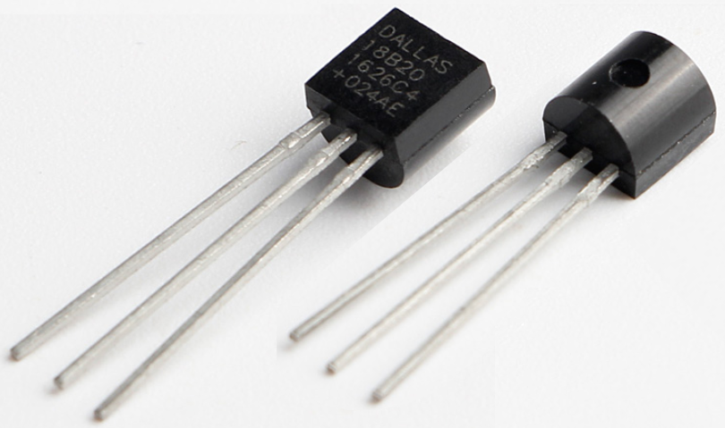
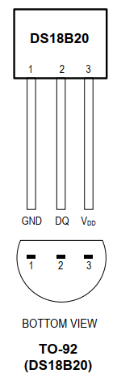
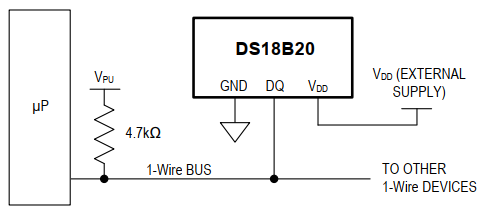
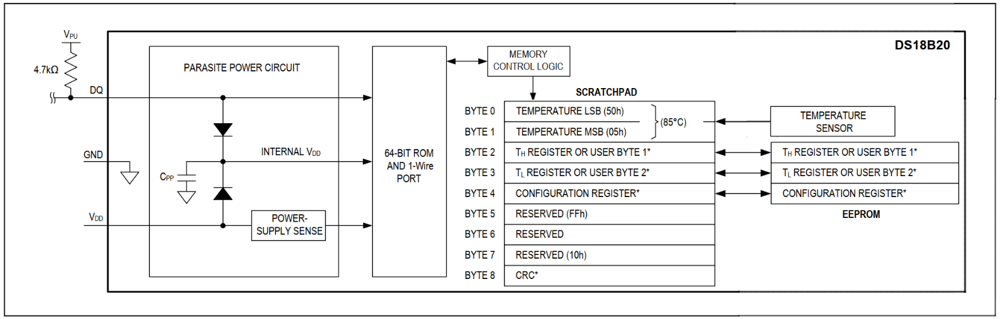
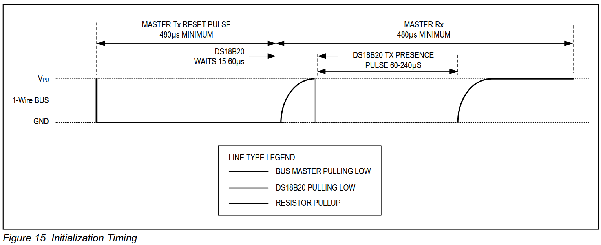
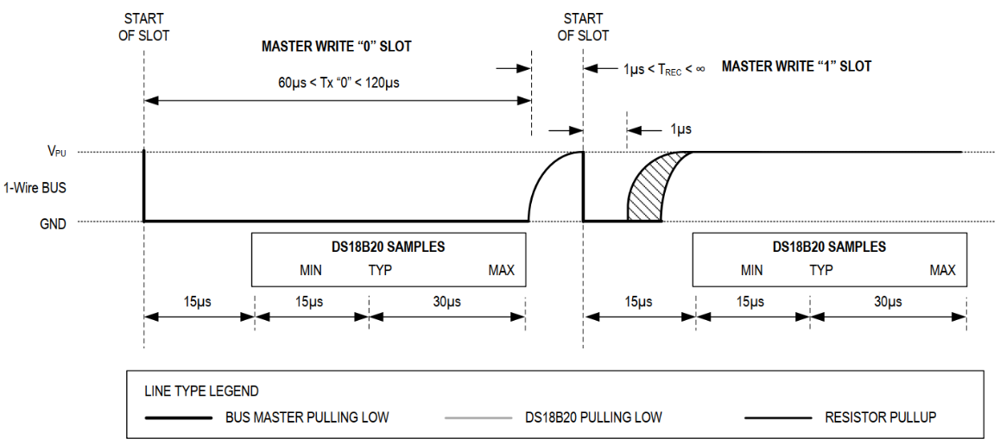
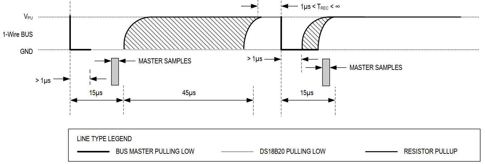
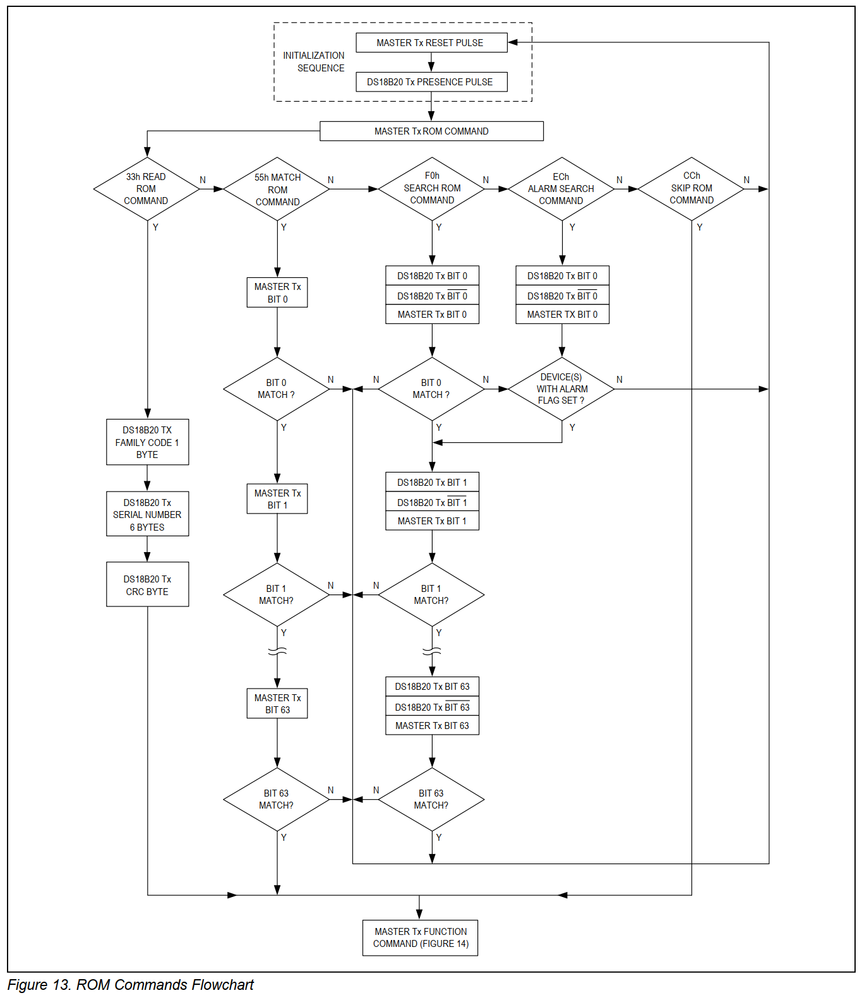
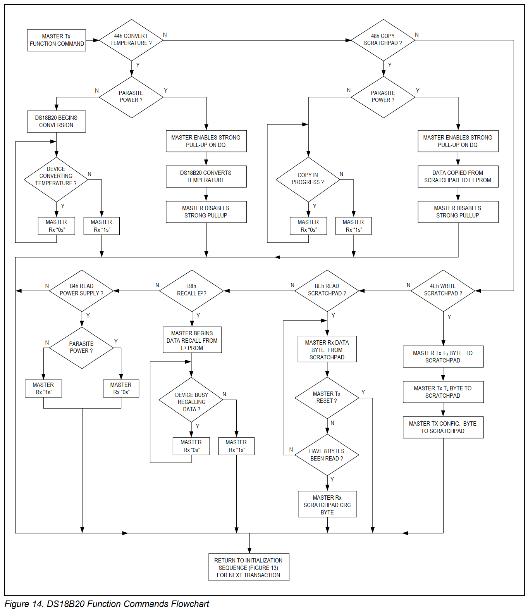

## DS18B20温度传感器

参考资料：GIT仓库

* datasheet\DS18B20(U2_TO-92).pdf

### 1. 芯片介绍

DS18B20是高精度温度传感器，比DHT11精度高。DS18B20内部有一个64位的ID，可以使用一条线连接多个DS18B20，通过ID来访问分辨、访问某个DS18B20。这使得可以在一个很大的区域里布置多个DS18B20，而只需要一个控制器就可以控制它们。
外形及引脚如下：

典型应用电路如下：

### 2. 访问方法概述

一个处理器可以使用一条IO线连接多个DS18B20，问题来了：怎么访问某个DS18B20？

* DS18B20内部有ID，每个芯片的ID都不一样
* 理论上一条线上可以挂无数个DS18B20，为了省点，它们平时都是休眠的，要唤醒才能工作
* 处理器要访问某个DS18B20时
  * 初始化：唤醒线路上的DS18B20
  * 发出ROM命令：想访问哪个DS18B20
  * 发出功能命令(Function Command)：要干嘛(比如启动温度转换、读内存)

#### 2.1 ROM命令

| ROM Commands |  命令名称  |                             描述                             |
| :----------: | :--------: | :----------------------------------------------------------: |
|     F0H      | Search ROM | 搜索ROM 用于确定挂接在同一总线上DS18B20的个数，识别64位ROM地址 |
|     33H      |  Read ROM  |          读ROM 读DS18B20芯片中的编码值，即64位ROM值          |
|     55H      | Match ROM  | 匹配ROM 发出此命令后，接着发出64位ROM编码，用于选中某个设备  |
|     CCH      |  Skip ROM  | 忽略ROM 表示后续发出的命令将会发给所有设备 如果总线上只有一个DS18B20，则特别适用此命令 |
|     ECH      | Alarm ROM  | 警报搜索 执行此命令后，只有温度超过设定值上限或下限的芯片才会做出响应 |

#### 2.2 功能命令

| Function Commands |       命令名称       |                             描述                             |
| :---------------: | :------------------: | :----------------------------------------------------------: |
|        44H        | Convert Teamperature | 启动温度转换，注意不同精度需要不同转换时间，结果存入内部RAM  |
|        4EH        |   Write Scratchpad   | 写内部RAM，可以写入3字节：TH，TL，配置值(用于选择精度)TH，TL可用于设置报警上下限，或给用户自己使用 |
|        BEH        |   Read Scratchpad    |                     读整个内部RAM，9字节                     |
|        48H        |   Copy Scratchpad    |          把内部RAM中的TH、TL、配置值，复制给EEPROM           |
|        B8H        |    Recall EEPROM     |           从EEPROM中把TH、TL、配置值，读到内部RAM            |
|        B4H        |  Read Power Supply   |    分辨DS18B20的供电方式：用电源引脚供电，或从数据线偷电     |

### 3. 内部结构

DS18B20内部：

* 有64位的ROM，用来存储ID
* 9byte的 scratchpad，也就是内存，从来保存温度值等
* 温度传感器(temperature sensor)，它是一个ADC，采样温度并转换为数值
* EEPROM：2字节用来保存报警温度的上限、下限，1字节用来保存配置信息(ADC精度)

以读取温度为例：

* 启动温度转换
  * 初始化
  * 发出ROM命令选择要访问的DS18B20
  * 发出功能命令0x44，启动温度转换
* 等待温度转换完毕，温度值会放入scratchpad的byte0、byte1
  * DS18B20内部在进行温度采集、ADC转换期间，会把数据线拉低
  * 当读数据线为高电平时，表示温度转换完毕
* 读取温度值
  * 初始化
  * 发出ROM命令选择要访问的DS18B20
  * 发出功能命令(0xBE)，读取scratchpad
* 如果只有一个DS18B20，发出的ROM命令可以是0xCC，表示“skip rom”，忽略ID，访问所有的设备

### 4. 通信协议

#### 4.1 初始化

数据线一开始是高电平，控制器想要开始传输信号时：

* 先拉低数据线至少480us，然后释放总线
* 经过15~60us之后，DS18B20会把这条线拉低60~240us，这是回应信号

#### 4.2 写1位数据

控制器向DS18B20发出1位数据，消耗的时间是60us~120us，被称为slot，时隙。

* 写0

  * 控制器发出15us的低电平，提醒DS18B20：我要发数据了
  * 在后续的45us内，控制器都保持数据线为低电平

* 写1

  * 控制器发出15us的低电平，提醒DS18B20：我要发数据了

  * 在后续的45us内，控制器设置数据线为高电平

* 位间隔：至少1us

  

#### 4.3 读1位数据

控制器读取DS18B20的1位数据，消耗的时间是60us~120us，被称为slot，时隙。

* 读出的数据是0

  * 控制器发出15us的低电平，提醒DS18B20：我要读数据了
  * 在这15us内，DS18B20把数据线驱动为低电平
  * 在后续的45us内，控制器读取数据线得到0

* 读出的数据是1

  * 控制器发出15us的低电平，提醒DS18B20：我要读数据了
  * 在这15us内，DS18B20把数据线驱动为高电平
  * 在后续的45us内，控制器读取数据线得到1

  

#### 4.4 流程图

芯片手册13、14页。

ROM命令流程图：

功能命令流程图：

