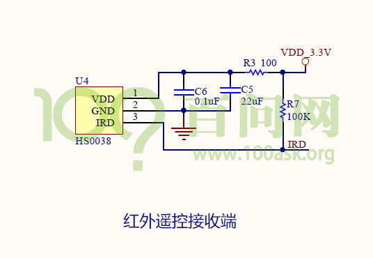
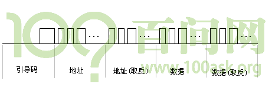
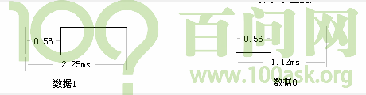
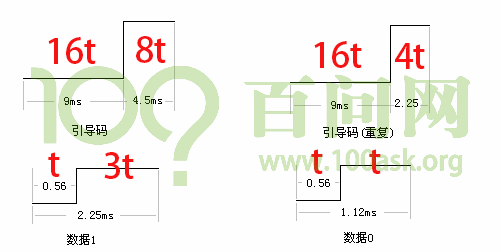
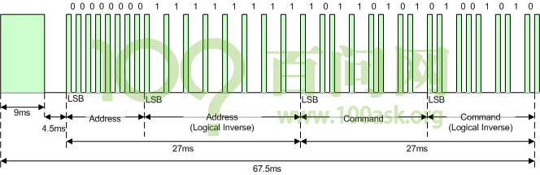

## 红外线遥控协议简介及编程思路 #
### 1. 硬件原理图

首先看一下原理图上的红外遥控接收器：

我们用遥控器对它按动的时候，它就可以接收到红外信号，然后把红外信号转换成电平信号，通过IRD这根线，传给SOC。
整个传输，只涉及单向传输，由HS0038向主芯片传送。
因此，我们只需要编写程序，从IRD上获取数据即可，在这之前，我们需要先了解下数据是怎么表示的，也就是传输的红外数据的格式。

### 2. NEC协议

红外协议有：NEC、SONY、RC5、RC6等，常用的就是NEC格式，因此我们主要对NEC进行讲解。

可以参考这个文章，直观的了解下NEC格式波形的样子：https://www.cnblogs.com/openusb/archive/2010/01/07/1641357.html
在分析文章中的波形之前，我们先想象一下怎么在一条数据线上传输信号。
开始传输数据之前，一般都会发出一个start起始信号，通知对方我开始传输数据了，后面就是每一位每一位的数据。
NEC协议的开始是一段引导码：

这个引导码由一个9ms的低脉冲加上一个4.5ms的高脉冲组成，它用来通知接收方我要开始传输数据了，如下图所示：

然后接着的是数据，数据由4字节组成：地址、地址(取反)、数据、数据(取反)，这些取反是用来校验用的。
地址是指遥控器的ID，每一类遥控器的ID都不一样，数据就是遥控器上的不同按键。
从前面的图可以知道，NEC每次要发32位的数据，每一位用什么来表示0和1呢？如下图所示：

数据1和01，开始都是0.56ms的低脉冲，对于数据1，后面的高脉冲比较长，对于数据0，后面的高脉冲比较短。
可以看出，红外遥控器的数据表示方法是比较简单的。

我们长按一个按键，第一次按的时候，他会发出引导码，地址，地址取反，数据，数据取反。
接着由于长按，遥控器会发送一个不一样的引导码，这个引导码由9ms的低脉冲，2.25ms的高脉冲组成，表示现在按的还是上次一样的按键，然后再一直是引导码(重复)，直到松开。
引导码(重复)格式如下图所示：

在后面的调试中，发现以上并不是NEC协议的全部，打开bing国际版搜索“ir nec protocal”，得到一篇官方文章：http://techdocs.altium.com/display/FPGA/NEC+Infrared+Transmission+Protocol
里面的内容和前面文章基本一致，但这个更详细，发现每次数据传输完还有一个0.5625ms的低脉冲表示数据传输结束。
对于引导码(重复)也一样，也有一个0.5625ms的低脉冲表示传输结束。
大部分文章都漏掉了结束的低脉冲。

NEC协议里有很多时间，这些时间有一个有趣的现象，把所有时间里面最小的0.53ms看作基本脉冲宽度，假设用t表示，那么其它所有时间都是t的倍数，如下图所示：

我们可以看到对于所有的时间，最小的单位都是0.56ms，这个时间对人来说是非常短的，但对嵌入式系统它是非常非常长的了，足够我们做很多事情了，那么我们可以使用中断来处理这些数据。
并且对于红外遥控器来说，我们根本不知道用户什么时候按下遥控器，使用轮询的方式特别耗资源，因此直接使用中断来处理。

使用官方文档的时序图：

图中的脉冲方向正好相反，绿色表示低脉冲，白色表示高脉冲。
涉及内容：
①中断引脚设置为双边缘触发，在每一个脉冲变化的地方都会产生中断；
②发生中断时，计算当前中断与上次中断之间的时间差，就得到脉冲宽度，放入buffer，同时还要记录引脚极性；
③主循环从buffer取出数据，并解析时序；

### 3. 编译方法

我们可以估算下，每按下一次遥控器，会产生多少中断，2+32*2+1=67次。
中断发生时，将数据放入buffer，主函数从buffer取出数据，用什么数据结构来实现数据的存取？
最好的方式就是环形缓冲区，所谓环形缓冲区就是一边存储数据一边读取数据，下节课再详细讲解。

编程要点：
①中断
②系统时间
③环形缓冲区
④NEC解析
